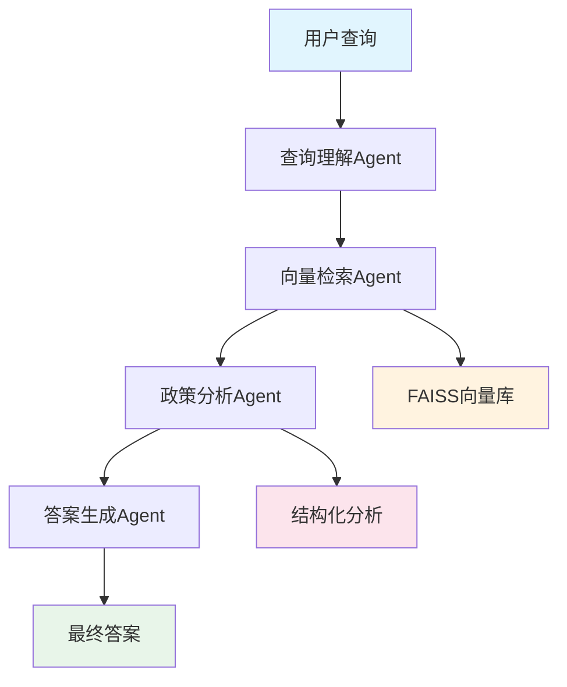
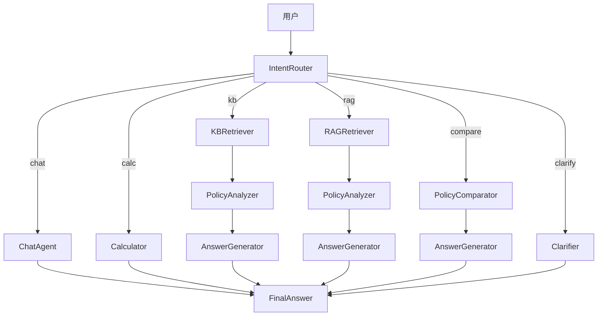

# 政策智能问答系统 v2.0

基于 AutoGen Core 框架的深度政策分析系统，专为政府政策文档智能问答设计。

## 🏛️ 系统架构

### 核心特性
claude mcp add microsoft-playwright-mcp -- npx -y @smithery/cli@latest run @microsoft/playwright-mcp --key 
- **多Agent协作架构** - 专业化分工的智能体系统
- **深度政策分析** - 结构化提取政策关键信息
- **向量语义检索** - 基于BGE等中文优化模型
- **智能答案生成** - 多意图识别与模板化生成
- **全流程追溯** - 完整的工作流状态管理

### Agent 架构

 


## 📦 安装

### 环境要求

- Python 3.9+
- 8GB+ RAM
- 支持CUDA的GPU（可选）

### 安装步骤

```bash
# 克隆项目
git clone https://github.com/your-org/policy-qa-system.git
cd policy-qa-system

# 安装依赖
pip install -r requirements.txt

# 配置环境变量
cp .env.example .env
# 编辑 .env 文件，设置 API Key 等
```

### 环境变量配置

```bash
# .env 文件
LLM_API_KEY=your_api_key_here
LLM_BASE_URL=https://api.deepseek.com
LLM_MODEL_NAME=deepseek-chat

# 可选：Neo4j配置
DATABASE__NEO4J_URI=bolt://localhost:7687
DATABASE__NEO4J_USER=neo4j
DATABASE__NEO4J_PASSWORD=your_password

# 可选：Milvus向量数据库配置
DATABASE__MILVUS_HOST=localhost
DATABASE__MILVUS_PORT=19530
DATABASE__MILVUS_USER=
DATABASE__MILVUS_PASSWORD=
DATABASE__MILVUS_DB_NAME=default
DATABASE__MILVUS_COLLECTION_NAME=policy_documents
DATABASE__MILVUS_USE_SECURE=false

# 多轮对话配置（可选）
CONVERSATION__MAX_TURNS=20
CONVERSATION__HISTORY_WINDOW=5

# LightRAG（图谱检索）配置（可选）
# LLM
LLM_MODEL=deepseek-chat
LLM_BINDING_API_KEY=$LLM_API_KEY
LLM_BINDING_HOST=https://api.deepseek.com
# Embedding
EMBEDDING_MODEL=bge-m3:latest
EMBEDDING_BINDING_HOST=http://localhost:11434
EMBEDDING_DIM=1024
MAX_EMBED_TOKENS=8192
# 工作目录与日志
LIGHTRAG_WORKDIR=resources/data/lightrag
LOG_DIR=.
LOG_MAX_BYTES=10485760
LOG_BACKUP_COUNT=5
VERBOSE_DEBUG=false
```

## 🚀 快速开始

### 1. 交互模式

```bash
# 加载政策文档并启动交互模式
python scripts/smart_cli.py --load-docs /path/to/policies --interactive

# 示例对话
请输入您的问题: 2025年家电以旧换新的补贴标准是多少？

## 申请资格条件

根据相关政策文件，您需要满足以下条件：

### 必要条件：
1. 具有济南市户籍
2. 在指定时间内购买新家电
3. 交回旧家电并完成报废处理

### 补贴说明：
- 最高补贴2000元
- 根据新家电价格按比例补贴
*来源置信度: 95.00%

政策来源:
1. 《济南市2025年家电以旧换新实施细则》
    发布机构: 济南市商务厅

置信度: 绿色92.0%
```

提示：多轮对话最大轮次可通过环境变量 `CONVERSATION__MAX_TURNS` 控制（默认 20）。会话上下文提取最近 `CONVERSATION__HISTORY_WINDOW` 轮对话（默认 5）。

如需启用图谱检索链（LightRAG），请确保：
- 已安装并可访问本地或远程 Ollama 嵌入服务（`EMBEDDING_BINDING_HOST`）。
- 设置好 LLM 访问配置（`LLM_MODEL`, `LLM_BINDING_API_KEY`, `LLM_BINDING_HOST`）。
- 数据将保存在 `LIGHTRAG_WORKDIR` 下。

### 2. 批量处理

```bash
# 创建查询文件 queries.txt
cat > queries.txt << EOF
汽车补贴申请条件
消费券发放时间
以旧换新适用范围
企业税收优惠政策
EOF

# 批量处理
python scripts/legacy_cli.py --load-docs /path/to/policies --batch queries.txt
```

### 3. 编程接口

```python
import asyncio
from agents.orchestrators.legacy import PolicyQAOrchestrator
from utils.config import Config

async def main():
    # 加载配置
    config = Config.from_env()

    # 初始化系统
    async with PolicyQAOrchestrator(
        model_config=config.model,
        vector_store_config=config.vector_store
    ) as orchestrator:
        # 加载文档
        await orchestrator.load_documents([
            "/path/to/policy/documents"
        ])

        # 查询
        response = await orchestrator.process_query(
            "新能源汽车补贴标准是什么？"
        )

        print(response.answer)
        print(f"置信度: {response.confidence:.1%}")

asyncio.run(main())
```

## 📊 系统组件

### 1. VectorRetrieverAgent (向量检索 Agent)
- **功能**: 基于向量相似度的政策文档检索（支持 OpenAI、DashScope Embeddings）
- **存储**:
  - FAISS 向量数据库（本地，默认）
  - Milvus 向量数据库（分布式，推荐生产环境）

### 2. PolicyAnalyzerAgent (政策分析Agent)
- **功能**: 深度解析政策文档，提取结构化信息
- **提取内容**:
  - 申请资格条件
  - 补贴标准与金额
  - 申请流程步骤
  - 所需材料清单
  - 重要时间节点
  - 联系方式

### 3. AnswerGeneratorAgent (答案生成Agent)
- **功能**: 基于分析结果生成准确答案
- **支持的查询类型**:
  - 资格查询 (ELIGIBILITY_CHECK)
  - 金额计算 (BENEFIT_CALCULATION)
  - 流程咨询 (APPLICATION_PROCESS)
  - 截止日期 (DEADLINE_QUERY)
  - 政策比较 (POLICY_COMPARISON)

## 🔧 配置说明

### 完整配置文件示例

```yaml
# config.yaml
model:
  model_name: "deepseek-chat"
  api_key: "${LLM_API_KEY}"
  base_url: "https://api.deepseek.com"
  temperature: 0.1
  max_tokens: 4000
  timeout: 120

vector_store:
  model_name: "BAAI/bge-large-zh-v1.5"
  index_path: "resources/data/vector_store/policy_index.faiss"
  metadata_path: "resources/data/vector_store/metadata.pkl"
  embedding_dim: 1024
  similarity_threshold: 0.7
  top_k: 10

logging:
  level: "INFO"
  file: "logs/policy_qa.log"
  format: "%(asctime)s - %(name)s - %(levelname)s - %(message)s"

database:
  neo4j_uri: "bolt://localhost:7687"
  neo4j_user: "neo4j"
  neo4j_password: "password"
  use_neo4j: false
```

## 🗄️ 使用 Milvus 向量数据库

### 为什么选择 Milvus？
- **分布式架构**: 支持大规模向量数据存储与检索
- **高性能**: 毫秒级查询响应，支持十亿级向量
- **生产就绪**: 支持持久化、备份、监控
- **灵活部署**: Docker/K8s/云服务多种部署方式

### 快速启动 Milvus

#### 1. 使用 Docker 启动 Milvus Standalone

```bash
# 下载 docker-compose 配置
wget https://github.com/milvus-io/milvus/releases/download/v2.4.0/milvus-standalone-docker-compose.yml -O docker-compose.yml

# 启动 Milvus
docker-compose up -d

# 查看状态
docker-compose ps
```

#### 2. 配置环境变量

在 `.env` 文件中添加：

```bash
# Milvus 配置
DATABASE__MILVUS_HOST=localhost
DATABASE__MILVUS_PORT=19530
DATABASE__MILVUS_COLLECTION_NAME=policy_documents
```

#### 3. 使用 MilvusRetrieverAgent

```python
from knowledge_base.milvus import MilvusStore
from models.base import PolicyDocument

# 初始化 Milvus 存储
store = MilvusStore(
    collection_name="policy_documents",
    backend="openai",  # 或 "ollama"
    model_name="text-embedding-3-small"
)

# 添加文档
documents = [
    PolicyDocument(
        id="doc1",
        title="政策标题",
        content="政策内容...",
        source="政府部门",
        doc_type="补贴政策",
        keywords=["补贴", "申请"],
        regions=["济南市"],
        target_groups=["企业"]
    )
]

await store.add_documents(documents)

# 查询
documents, scores = await store.search(
    query="政策查询文本",
    top_k=10,
    threshold=0.7
)
```

#### 4. 切换到 Milvus（代码示例）

在编排器或脚本中，将 `VectorRetrieverAgent` 替换为 `MilvusRetrieverAgent`：

```python
# 原来使用 FAISS
# from knowledge_base import VectorStore
# store = VectorStore(...)

# 切换到 Milvus
from knowledge_base import MilvusStore
store = MilvusStore(
    collection_name="policy_documents",
    backend="openai"
)
```

### Milvus 性能优化

- **索引类型**: 默认使用 IVF_FLAT，可根据数据规模调整
- **批量插入**: 建议批量添加文档以提高效率
- **连接池**: 生产环境建议配置连接池
- **监控**: 使用 Attu (Milvus GUI) 监控集合状态

## 📈 性能优化

### 1. 向量检索优化
- 使用量化索引减少内存占用
- 批量编码提高处理速度
- 缓存常见查询结果
- **推荐**: 生产环境使用 Milvus 替代 FAISS

### 2. 并发处理
- 异步Agent通信
- 批量文档处理
- 流式响应输出

### 3. 内存管理
- LRU缓存策略
- 分块加载大文档
- 定期清理临时数据

## 🧪 测试

```bash
# 运行单元测试
pytest tests/

# 运行集成测试
pytest tests/integration/

# 性能测试
python tests/performance.py
```

## 🧭 运行指南（Smart Orchestrator）

### 1) 安装依赖

```bash
pip install -r requirements.txt
# 或者确保安装了 OpenAI 兼容扩展与 LightRAG：
pip install "autogen-ext[openai]"
pip install lightrag
```

### 2) 配置环境（.env）

```bash
# 初始化环境文件
cp .env.example .env

# 大模型（LLM）
LLM_API_KEY=your_api_key
LLM_BASE_URL=https://api.deepseek.com
LLM_MODEL_NAME=deepseek-chat
LLM_TEMPERATURE=0

# 多轮对话（基础设施，非智能体）
CONVERSATION__MAX_TURNS=20
CONVERSATION__HISTORY_WINDOW=5

# 并行/早停（可选）
EARLY_STOP_CONF=0.80

# LightRAG（可选，用于图谱检索链）
LIGHTRAG_WORKDIR=resources/data/lightrag
EMBEDDING_MODEL=bge-m3:latest
EMBEDDING_BINDING_HOST=http://localhost:11434
EMBEDDING_DIM=1024
MAX_EMBED_TOKENS=8192

# 向量检索（KB）嵌入后端（避免强制安装 torch）
# openai（默认，轻量）：使用 OpenAI Embeddings API
# ollama：使用本地 Ollama 嵌入（需本地服务）
EMBEDDING_BACKEND=openai
EMBEDDING_MODEL=text-embedding-3-small

# Reranker（可选：DashScope 文本排序）
RERANKER_BACKEND=dashscope
DASHSCOPE_API_KEY=your_dashscope_key
RERANKER_MODEL=gte-rerank-v2
RERANKER_TOP_N=5

# Reranker 策略（可选）
# replace：仅按重排分数排序；fuse：融合 FAISS 分数与重排分数
RERANKER_STRATEGY=replace
RERANK_WEIGHT=0.7
FAISS_WEIGHT=0.3
```

说明：
- 仅启用 KB 链路可不配置 LightRAG；需要图谱检索链时，请准备好本地 Ollama 嵌入服务。

### 3) 加载文档索引（可选）

```bash
# 将本地政策资料加载进向量库与 LightRAG 存储
python scripts/smart_cli.py --load-docs ./knowledge_base/documents --interactive
```

### 4) 交互/演示/批量 / 后端服务

```bash
# 交互模式（推荐）
python scripts/smart_cli.py --interactive

# 演示（内置示例）：
python scripts/smart_cli.py --demo

# 批量模式
python scripts/smart_cli.py --batch queries.txt

# 启动后端 API（FastAPI）
uvicorn app:app --host 0.0.0.0 --port 8000 --reload

# 例子：
# POST http://localhost:8000/query  {"query":"申请汽车补贴需要什么条件？"}
```

### 5) 工作原理（按意图分支 + 按需并行）

- 意图路由（LLM+规则）：
  - greeting/farewell/chit_chat/general_query → chat_chain
  - calculation → calculation_chain（必要时补检索）
  - policy_inquiry.{eligibility|process|deadline|documents|contact} → kb_chain
  - summary（概括/主题/关系） → graph_chain（LightRAG）
  - comparison → comparison_chain
  - clarification → clarification_chain（澄清问题）
- 低置信或含混 → hybrid：并行 kb_chain + graph_chain，先达到阈值（EARLY_STOP_CONF）早停；否则择优（最高置信）。
- 分析并发：对候选文档并发抽取结构化要素（Semaphore 限流）。
- 多轮对话：基础设施层缓存最近 N 轮历史，不作为智能体参与路由。

### 7) 基于 Autogen 的智能体实现

- LLM 意图路由：`agents/router/llm_classifier.py` 使用 `AssistantAgent` + `OpenAIChatCompletionClient`，按 `agents/router/prompt.py` 的 JSON 协议返回意图与链路。
- 政策分析与答案生成（LLM 优先）：
  - `PolicyAnalyzer` 与 `AnswerGenerator` 在提供 `model_client` 时，使用 `AssistantAgent` 搭配缓冲上下文（`BufferedChatCompletionContext`）进行抽取与生成；失败时回退到规则/模板逻辑。
  - 配置通过 `.env` 的 `LLM_*` 注入。

示例（模型客户端）：
```python
from agents.common.model_client import create_openai_client, create_buffered_context
client = create_openai_client()
ctx = create_buffered_context(10)
```

### 6) LightRAG 说明（可选）

- 首次运行会在 `LIGHTRAG_WORKDIR` 初始化存储。
- `--load-docs` 会自动将文档内容注入 LightRAG 存储（需要本地嵌入服务）。
- 图谱检索链（graph_chain）适合“概括/主题/关系/脉络”类问题。

## 🧹 清理

使用脚本安全清理项目中的临时/缓存/日志等“可忽略文件”。脚本仅删除 `.gitignore` 中列出的忽略文件（等价于 `git clean -fdX`），不会影响已跟踪的源码。

```bash
# 预览将要删除的文件（默认干跑）
bash scripts/clean.sh

# 实际删除（不提示）
bash scripts/clean.sh --no-dry-run --yes

# 手动确认删除（会提示确认）
bash scripts/clean.sh --no-dry-run
```

当前清理范围包括：
- 缓存与编译产物：`__pycache__/`, `*.py[cod]`, `.pytest_cache/`, `.mypy_cache/` 等
- 构建产物：`build/`, `dist/`, `*.egg-info/`, `.eggs/`
- 日志：`logs/`, `*.log`
- 向量索引缓存：`data/vector_store/`
- IDE 目录：`.idea/`, `.vscode/`

## 📝 开发指南

### 意图路由（LLM + 规则，按需并行）

新增 LLM 意图路由（agents/router/prompt.py + IntentRouterAgent）：
- 先用大模型根据提示分类意图与推荐处理链（chat/calculation/comparison/kb/graph/hybrid），并给出是否需要并行（requires_parallel）。
- 若 LLM 不可用或失败，回退到规则分类（关键词+正则）。
- Orchestrator 接收路由结果：
  - 单链：只执行该链（最小必要路径）。
  - 低置信/歧义：并行执行多链（如 kb_chain + graph_chain），采用早停或择优返回。

环境变量：
- LLM_API_KEY / LLM_BASE_URL / LLM_MODEL_NAME 控制 LLM 接口（兼容 OpenAI 风格）。

### 意图细化与链路映射

- greeting / farewell / chit_chat / general_query → chat_chain（仅 ChatAgent）
- calculation（金额/比例/标准） → calculation_chain（Calculator，可按需补检索）
- policy_inquiry：
  - eligibility / process / deadline / documents / contact → kb_chain（KBRetriever→Analyzer→Generator）
- summary（概括/主题/关系/图谱） → graph_chain（RAGRetriever→Analyzer→Generator）
- comparison（对比/哪个好/差异） → comparison_chain（KBRetriever→Comparator→Generator）
- clarification（意图不明） → clarification_chain（Clarifier 生成澄清问题）

当路由置信度低或查询含混时，执行 hybrid（并行 kb_chain + graph_chain），采用早停或择优。

### 架构图（并行优先）



### 智能体说明

- IntentRouter：基于 LLM+规则细化意图，给出处理链与是否并行。
- KBRetriever（VectorRetrieverAgent）：向量库检索（FAISS），返回候选文档。
- RAGRetriever（GraphRetrieverAgent）：LightRAG 图谱检索（naive/local/global/hybrid）。
- PolicyAnalyzer：并发抽取结构化要素（资格/流程/截止/材料/金额线索等）。
- AnswerGenerator：模板化/LLM 生成最终答复，支持证据与信心评估。
- PolicyComparator：多政策维度对比。
- Calculator：补贴金额估算（必要时引用检索结果规则）。
- Clarifier：低置信/歧义时提出澄清问题。

提示：多轮对话为基础设施能力，系统在会话开始启用历史上下文缓存（不参与路由），仅保留最近 N 轮历史（.env: CONVERSATION__MAX_TURNS / CONVERSATION__HISTORY_WINDOW）。

### 添加新的Agent

```python
from agents.base.base_agent import PolicyAgentBase

class CustomAgent(PolicyAgentBase):
    def __init__(self):
        super().__init__(
            agent_type=AgentType.CUSTOM,
            name="CustomAgent",
            description="自定义Agent"
        )

    async def _handle_user_query(self, message, ctx):
        # 实现处理逻辑
        pass
```

### 添加新的查询意图

```python
# models/base.py
class QueryIntent(str, Enum):
    # ... 现有意图
    CUSTOM_INTENT = "custom_intent"

# agents/generation/answer_generator.py
self.templates[QueryIntent.CUSTOM_INTENT] = self._custom_template
```

## 🤝 贡献

欢迎提交Issue和Pull Request！

### 开发流程
1. Fork 项目
2. 创建特性分支 (`git checkout -b feature/AmazingFeature`)
3. 提交更改 (`git commit -m 'Add some AmazingFeature'`)
4. 推送到分支 (`git push origin feature/AmazingFeature`)
5. 开启 Pull Request

## 📄 许可证

本项目采用 MIT 许可证 - 查看 [LICENSE](LICENSE) 文件了解详情。

## 🙏 致谢

- [AutoGen](https://github.com/microsoft/autogen) - 多Agent框架
- [BGE](https://github.com/FlagOpen/FlagEmbedding) - 中文向量模型
- [FAISS](https://github.com/facebookresearch/faiss) - 向量检索库

## 📞 联系

- 项目主页: https://github.com/your-org/policy-qa-system
- 问题反馈: https://github.com/your-org/policy-qa-system/issues
- 邮箱: your-email@example.com
