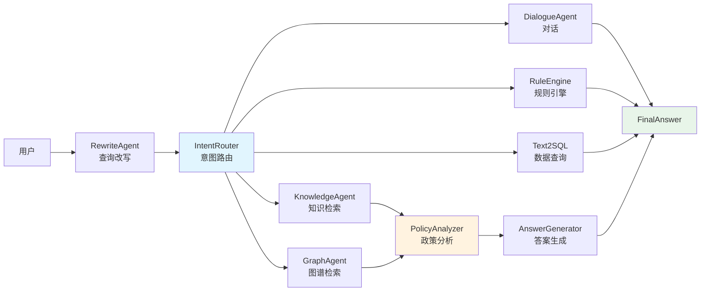

# Glyph - 政策智能问答系统

<div align="center">

**基于 AutoGen Core 的企业级政策分析与问答系统**

[](https://www.python.org)
[](https://fastapi.tiangolo.com)
[](LICENSE)

[功能特性](#功能特性) • [快速开始](#快速开始) • [系统架构](#系统架构) • [部署指南](#部署指南) • [开发文档](#开发指南)

</div>

---

## 简介

Glyph 是一个企业级政策智能问答系统，专为政府机构和企业提供精准的政策咨询服务。系统采用多Agent协作架构，结合知识图谱、向量检索和大语言模型，实现政策文档的深度理解和智能问答。

### 核心能力

- **多Agent协作** - 意图识别、知识检索、政策分析、答案生成等专业化智能体
- **混合检索** - 向量检索(Milvus) + 知识图谱(LightRAG) + 规则引擎(DSL)
- **多轮对话** - 上下文理解与会话管理
- **Text2SQL** - 自然语言转SQL查询
- **结构化提取** - 政策要素自动抽取（资格、流程、时间、材料等）
- **RESTful API** - 完整的后端服务接口

---

## 功能特性

### 1. 智能路由系统

```
用户查询 → 意图识别 → 智能路由 → 专业Agent → 答案生成
```

支持的意图类型：
- **政策查询** (`policy_inquiry`) - 资格、流程、截止日期等
- **政策对比** (`comparison`) - 多个政策的对比分析
- **政策摘要** (`summary`) - 政策概述与关键信息提取
- **金额计算** (`calculation`) - 补贴金额估算
- **数据查询** (`database_query`) - SQL数据库查询
- **对话交互** (`chit_chat`) - 问候、闲聊等

### 2. 多引擎检索

| 引擎 | 适用场景 | 技术栈 |
|------|---------|--------|
| **向量检索** | 语义相似度查询 | Milvus + OpenAI/DashScope Embeddings |
| **图谱检索** | 关系推理、概念关联 | LightRAG (Neo4j-like graph) |
| **规则引擎** | 确定性计算、条件判断 | YAML DSL + PolicyEngine |
| **SQL查询** | 结构化数据查询 | ChatDB (Text2SQL) |

### 3. Agent架构



---

## 快速开始

### 环境要求

- Python 3.9 或更高版本
- MySQL 8.0（Text2SQL/会话存储）
- Milvus 2.4（向量检索）
- Node.js 18+（前端调试时需要）
- 8GB 以上内存，建议开启虚拟内存或使用 GPU 进行批量嵌入

### 本地安装步骤

1. **克隆代码并安装依赖**
   ```bash
   git clone <your-repo-url>
   cd Glyph
   python -m venv .venv && source .venv/bin/activate  # Windows: .venv\Scripts\activate
   pip install -r requirements.txt
   ```
2. **配置 `.env`**
   ```bash
   cp .env.example .env
   ```
   至少需要设置以下项：
   - `LLM_API_KEY` / `LLM_BASE_URL` / `LLM_MODEL_NAME`
   - `EMBEDDING_BACKEND` 及对应的 API Key（OpenAI 或 DashScope）
   - `DATABASE__MYSQL_*` 与 `DATABASE__MILVUS_*`
   - `LIGHTRAG_WORKDIR`（默认即可）

3. **启动 MySQL 并初始化表**
   ```bash
   mysql -u root -p < resources/database/schema/policy_qa_schema.sql
   python create_tables.py
   ```

4. **启动 Milvus（示例使用官方 docker-compose）**
   ```bash
   wget https://github.com/milvus-io/milvus/releases/download/v2.4.0/milvus-standalone-docker-compose.yml -O docker-compose.yml
   docker-compose up -d
   ```

5. **启动 API**
   ```bash
   python api_server.py
   # 默认监听 http://localhost:8000
   ```

6. **健康检查**
   ```bash
   curl http://localhost:8000/health
   ```

### 使用 Docker 构建与运行

```bash
# 在项目根目录构建镜像
docker build -t glyph-policy-qa:latest .

# 以 .env 中的配置启动容器
docker run -d \
  -p 8000:8000 \
  --env-file .env \
  --name glyph-api \
  glyph-policy-qa:latest

# 进入容器以执行嵌入/导入脚本
docker exec -it glyph-api bash

# 停止并移除
docker stop glyph-api && docker rm glyph-api
```

（如需同时运行 MySQL、Milvus，可在宿主机或独立容器中启动，保持 `.env` 中的地址可达。）

### 导入示例数据

1. **生成 Text2SQL 数据库**
   ```bash
   sqlite3 resources/sql/policy_demo.db < resources/sql/policy_demo.sql
   python scripts/register_text2sql_connection.py  # 记录返回的 connection_id
   ```

2. **嵌入政策文档到向量库 / LlamaIndex**
   ```bash
   python scripts/ingest_policy_docs.py --source resources/data/process
   ```

3. **写入 LightRAG 图谱（可选但建议执行）**
   ```bash
   python scripts/seed_lightrag.py --input-dir resources/data/process
   ```

4. **验证数据是否生效**
   - `python scripts/unified_cli.py --interactive` 可快速检索文档
   - `sqlite3 resources/sql/policy_demo.db ".tables"` 检查表已生成
   - `mysql -u root -p policy_db -e "SHOW TABLES"` 确认 `chatsession/chatmessage` 等表存在

### 自动化验证

1. **界面层脚本**
   ```bash
   ./run_50_tests.sh   # 选择模式 2 可顺序测试 42 条问题
   ```
   运行完成后会生成 `test_results_50_questions.{json,md}`，可用于校验路由与答案。

2. **单元与集成测试**
   ```bash
   pytest tests -q
   ```

3. **手动接口检查**
   ```bash
   curl -X POST http://localhost:8000/api/agent/chat \
     -H "Content-Type: application/json" \
     -d '{"message": "家电以旧换新的补贴标准是什么？", "session_id": "demo"}'
   ```

### 交互式CLI

```bash
# 启动交互模式
python scripts/unified_cli.py --interactive

# 示例对话
> 家电以旧换新能补贴多少钱？

【政策分析】
补贴标准：
- 家电以旧换新最高补贴 2000 元
- 按新家电价格的 15% 补贴
- 不同品类补贴标准不同

来源：《济南市家电以旧换新实施细则》
置信度: 92.5%
```

---

## 系统架构

### 整体架构

```
┌─────────────────────────────────────────────────────┐
│                   用户接口层                          │
│  FastAPI REST API │ CLI │ 批处理接口                 │
└────────────────┬────────────────────────────────────┘
                 │
┌────────────────▼────────────────────────────────────┐
│              AgentService (核心服务层)                │
│  • 会话管理  • 意图路由  • Agent编排  • 结果聚合      │
└────────────────┬────────────────────────────────────┘
                 │
        ┌────────┴────────┐
        │                 │
┌───────▼──────┐  ┌───────▼──────┐
│  Agent Pipeline │  │ Tools Layer  │
│                 │  │              │
│ • RewriteAgent │  │ • KnowledgeTool (Milvus)  │
│ • IntentRouter │  │ • IntentTool (LLM分类)    │
│ • DialogueAgent│  │ • WebSearchTool (Tavily) │
│ • KnowledgeAgent│ │ • VisionTool (GPT-4V)    │
│ • GraphAgent   │  │ • UserProfileTool        │
│ • RuleEngine   │  │                          │
│ • Text2SQLAgent│  │                          │
│ • PolicyAnalyzer│ │                          │
│ • AnswerGenerator│ │                        │
└─────────────────┘  └─────────────────────────┘
         │
┌────────▼──────────────────────────────────────────┐
│                   存储层                           │
│  Milvus (向量) │ MySQL (结构化) │ LightRAG (图谱) │
└───────────────────────────────────────────────────┘
```

### 技术栈

| 层级 | 技术选型 |
|------|---------|
| **Web框架** | FastAPI 0.100+ |
| **Agent框架** | AutoGen Core |
| **LLM** | DeepSeek/OpenAI/Compatible APIs |
| **向量数据库** | Milvus 2.4+ |
| **关系数据库** | MySQL 8.0+ |
| **图数据库** | LightRAG (内置) |
| **嵌入模型** | OpenAI text-embedding-3 / DashScope |
| **重排序** | DashScope gte-rerank-v2 (可选) |

---

## 核心组件

### 1. RewriteAgent - 查询改写

**功能**: 将用户原始查询改写为结构化、明确的查询

```python
# 用户: "想买家电"
# 改写后: "家电以旧换新政策的申请条件和补贴标准"
```

### 2. IntentRouter - 意图路由

**功能**: 识别用户意图并选择合适的处理链路

**路由规则** (app/agents/service/agent_service.py:362-402):

```python
def _resolve_route(intent, query, ...):
    if intent == "chit_chat": return "dialogue"
    if intent == "calculation": return "rule_engine"
    if intent == "summary": return "graph"
    if intent == "comparison": return "knowledge"
    if looks_like_sql(query): return "text2sql"
    return "knowledge"  # 默认
```

### 3. KnowledgeAgent - 知识库检索

**检索流程**:
1. 向量检索 (Milvus) - 语义相似度Top-K
2. 重排序 (可选) - DashScope Reranker
3. 政策分析 - 结构化信息提取
4. 答案生成 - 模板化/LLM生成

### 4. GraphAgent - 图谱检索

**基于 LightRAG**:
- **Naive**: 简单文本匹配
- **Local**: 局部子图检索
- **Global**: 全局图谱推理
- **Hybrid**: 混合模式

**初始化状态**:
```bash
✅ LightRAG 已初始化
✅ 文档索引: 12 篇
✅ 数据目录: resources/data/lightrag/
```

### 5. RuleEngine - 规则引擎

**基于 YAML DSL**:

```yaml
# resources/dsl/rules/济南_家电补贴_2025.yaml
policy_meta:
  id: Rule_济南_家电补贴_2025
  name: 济南市2025年家电以旧换新补贴政策

eligibility:
  conditions:
    - field: user_location
      operator: in
      value: [济南市, 历下区, 市中区]
    - field: old_appliance_years
      operator: ">="
      value: 5

calculation:
  base_amount: 0
  rules:
    - condition: new_price >= 3000
      formula: "new_price * 0.15"
      max: 2000
```

### 6. Text2SQLAgent - 自然语言转SQL

**示例查询**:

```
用户: "一共有多少个政策文件？"
SQL: SELECT COUNT(*) FROM policies;

用户: "家电类政策有哪些？"
SQL: SELECT title FROM policies WHERE category = '家电' LIMIT 10;
```

---

## 配置说明

### 完整 .env 配置

```bash
# ==================== LLM 配置 ====================
LLM_API_KEY=sk-xxx
LLM_BASE_URL=https://api.deepseek.com
LLM_MODEL_NAME=deepseek-chat
LLM_TEMPERATURE=0
LLM_MAX_TOKENS=4000
LLM_TIMEOUT=120

# ==================== 嵌入配置 ====================
# 向量检索嵌入 (KnowledgeTool)
EMBEDDING_BACKEND=openai  # openai | dashscope
EMBEDDING_OPENAI_API_KEY=sk-xxx
EMBEDDING_OPENAI_MODEL=text-embedding-3-small
EMBEDDING_DASHSCOPE_API_KEY=sk-xxx
EMBEDDING_DASHSCOPE_MODEL=text-embedding-v3

# LightRAG 嵌入 (GraphAgent)
EMBEDDING_DASHSCOPE_API_KEY=sk-xxx
EMBEDDING_DASHSCOPE_DIMENSION=1024

# ==================== Reranker 配置 (可选) ====================
RERANKER_BACKEND=dashscope
DASHSCOPE_API_KEY=sk-xxx
RERANKER_MODEL=gte-rerank-v2
RERANKER_TOP_N=5
RERANKER_STRATEGY=replace  # replace | fuse

# ==================== Milvus 配置 ====================
DATABASE__MILVUS_HOST=localhost
DATABASE__MILVUS_PORT=19530
DATABASE__MILVUS_COLLECTION_NAME=policy_documents
DATABASE__MILVUS_USER=
DATABASE__MILVUS_PASSWORD=
DATABASE__MILVUS_DB_NAME=default
DATABASE__MILVUS_USE_SECURE=false

# ==================== MySQL 配置 ====================
DATABASE__MYSQL_HOST=localhost
DATABASE__MYSQL_PORT=3306
DATABASE__MYSQL_USER=root
DATABASE__MYSQL_PASSWORD=your_password
DATABASE__MYSQL_DATABASE=policy_qa

# ==================== LightRAG 配置 ====================
LIGHTRAG_WORKDIR=resources/data/lightrag
LIGHTRAG_QUERY_MODE=hybrid  # naive | local | global | hybrid
LIGHTRAG_EMBED_RETRY=3

# ==================== 多轮对话配置 ====================
CONVERSATION__MAX_TURNS=20
CONVERSATION__HISTORY_WINDOW=5

# ==================== 性能优化配置 ====================
EARLY_STOP_CONF=0.80  # 早停置信度阈值
ANALYZER_CONCURRENCY=3  # 政策分析并发数
```

---

## 性能优化

### 1. 向量检索优化

```python
# 使用 Reranker 提升准确率
RERANKER_BACKEND=dashscope
RERANKER_STRATEGY=fuse  # 融合向量分数和重排分数
RERANK_WEIGHT=0.7
FAISS_WEIGHT=0.3
```

### 2. LightRAG 优化

```bash
# 选择合适的查询模式
LIGHTRAG_QUERY_MODE=hybrid  # 混合模式，平衡速度和准确率
```

### 3. 并发控制

```python
# 限制分析并发数，避免API限流
ANALYZER_CONCURRENCY=3
```

---

## 测试

### 运行测试套件

```bash
# 单元测试
pytest tests/

# 集成测试
pytest tests/integration/

# Agent场景测试
python test_agent_scenarios.py

# LightRAG检索测试
python test_lightrag_retrieval.py
```

### 测试报告

查看 `AGENT_TEST_REPORT.md` 获取最新测试结果。

---

## 部署指南

### Docker 部署

```bash
# 构建镜像
docker build -t glyph-policy-qa:latest .

# 启动服务
docker run -d \
  -p 8000:8000 \
  --env-file .env \
  --name glyph-api \
  glyph-policy-qa:latest
```

### 生产环境建议

1. **使用 Gunicorn/Uvicorn workers**:
```bash
gunicorn app.main:app \
  --workers 4 \
  --worker-class uvicorn.workers.UvicornWorker \
  --bind 0.0.0.0:8000
```

2. **Nginx 反向代理**:
```nginx
upstream glyph_api {
    server 127.0.0.1:8000;
}

server {
    listen 80;
    server_name your-domain.com;

    location / {
        proxy_pass http://glyph_api;
        proxy_set_header Host $host;
        proxy_set_header X-Real-IP $remote_addr;
    }
}
```

3. **监控与日志**:
- 使用 Prometheus + Grafana 监控
- 集成 ELK/Loki 日志系统
- 配置健康检查端点 `/health`

---

## 开发指南

### 添加新的 Agent

1. **创建 Agent 类**:

```python
# app/agents/packs/my_agent/node.py
from app.agents.framework.base.base_agent import PolicyAgentBase
from app.models.base import AgentType, MessageType

class MyCustomAgent(PolicyAgentBase):
    def __init__(self):
        super().__init__(
            agent_type=AgentType.CUSTOM,
            name="MyCustomAgent",
            description="自定义Agent功能描述"
        )

    async def _handle_user_query(self, message, ctx):
        # 处理用户查询
        return result

    async def _handle_query_analysis(self, message, ctx):
        # 处理查询分析
        return result
```

2. **注册到 AgentService**:

```python
# app/agents/service/agent_service.py
from app.agents.packs.my_agent.node import MyCustomAgent

class AgentService:
    def __init__(self):
        # ...
        self.my_custom_agent = MyCustomAgent()
```

3. **添加路由规则**:

```python
# app/agents/service/agent_service.py
def _resolve_route(self, intent_result, ...):
    if intent == "my_custom_intent":
        return "my_custom"
    # ...
```

### 添加新的意图

```python
# app/models/base.py
class QueryIntent(str, Enum):
    # 现有意图...
    MY_CUSTOM_INTENT = "my_custom_intent"
```

### 添加新的 DSL 规则

```yaml
# resources/dsl/rules/my_policy.yaml
policy_meta:
  id: Rule_MyPolicy_2025
  name: 自定义政策规则

eligibility:
  conditions:
    - field: age
      operator: ">="
      value: 18

calculation:
  rules:
    - condition: income < 50000
      formula: "base_amount * 1.5"
```

---

## 维护工具

### 清理临时文件

```bash
# 预览将删除的文件
bash scripts/clean.sh

# 实际执行清理
bash scripts/clean.sh --no-dry-run --yes
```

### 数据库维护

```bash
# 备份 MySQL
mysqldump -u root -p policy_qa > backup.sql

# 重建 Milvus collection
python scripts/rebuild_milvus.py
```

---

## 已知问题

### LightRAG 嵌入函数异步问题

**问题**: LightRAG 文档处理时出现 `TypeError: object list can't be used in 'await' expression`

**影响**: 部分文档的高级处理（知识图谱构建）失败，但基础检索功能正常

**状态**: 已识别，待修复

**解决方案**: 将嵌入函数改为异步函数

### 路由逻辑限制

**问题**: 当前只有 `summary` 意图才会路由到 LightRAG

**影响**: LightRAG 未被充分利用

**建议**: 扩展路由条件，将更多政策查询路由到 graph

---

## Roadmap

- [ ] 修复 LightRAG 异步嵌入问题
- [ ] 优化路由策略，提升 LightRAG 使用率
- [ ] 增加政策对比的可视化展示
- [ ] 支持多租户与权限管理
- [ ] 添加政策变更监控与通知
- [ ] 开发管理后台
- [ ] 支持更多数据源（PDF、Excel等）

---

## 贡献指南

我们欢迎所有形式的贡献！

### 贡献流程

1. Fork 本项目
2. 创建特性分支 (`git checkout -b feature/AmazingFeature`)
3. 提交变更 (`git commit -m 'Add some AmazingFeature'`)
4. 推送到分支 (`git push origin feature/AmazingFeature`)
5. 创建 Pull Request

### 代码规范

- 遵循 PEP 8
- 添加类型注解
- 编写单元测试
- 更新文档

---

## 许可证

本项目采用 MIT 许可证 - 详见 [LICENSE](LICENSE) 文件

---

## 致谢

- [AutoGen](https://github.com/microsoft/autogen) - 多Agent协作框架
- [LightRAG](https://github.com/HKUDS/LightRAG) - 轻量级知识图谱检索
- [Milvus](https://milvus.io/) - 向量数据库
- [FastAPI](https://fastapi.tiangolo.com/) - 现代Web框架
- [DeepSeek](https://www.deepseek.com/) - 大语言模型

---

 
 
<div align="center">


Made with care by the Glyph Team

</div>
