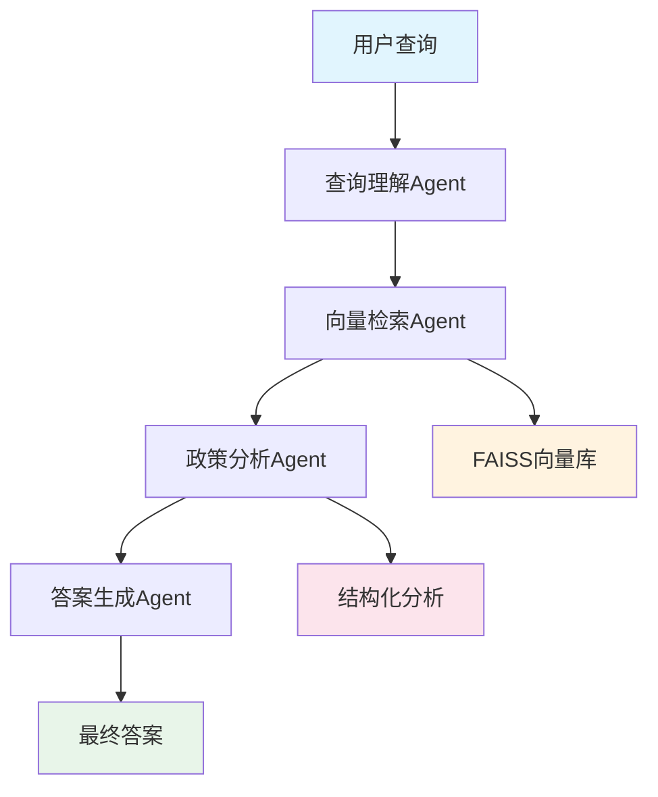

# 政策智能问答系统 v2.0

基于 AutoGen Core 框架的深度政策分析系统，专为政府政策文档智能问答设计。

## 🏛️ 系统架构

### 核心特性
claude mcp add microsoft-playwright-mcp -- npx -y @smithery/cli@latest run @microsoft/playwright-mcp --key 
- **多Agent协作架构** - 专业化分工的智能体系统
- **深度政策分析** - 结构化提取政策关键信息
- **向量语义检索** - 基于BGE等中文优化模型
- **智能答案生成** - 多意图识别与模板化生成
- **全流程追溯** - 完整的工作流状态管理

### Agent 架构

 


## 📦 安装

### 环境要求

- Python 3.9+
- 8GB+ RAM
- 支持CUDA的GPU（可选）

### 安装步骤

```bash
# 克隆项目
git clone https://github.com/your-org/policy-qa-system.git
cd policy-qa-system

# 安装依赖
pip install -r requirements.txt

# 配置环境变量
cp .env.example .env
# 编辑 .env 文件，设置 API Key 等
```

### 环境变量配置

```bash
# .env 文件
MODEL__API_KEY=your_api_key_here
MODEL__BASE_URL=https://api.deepseek.com
MODEL__MODEL_NAME=deepseek-chat

# 可选：Neo4j配置
DATABASE__NEO4J_URI=bolt://localhost:7687
DATABASE__NEO4J_USER=neo4j
DATABASE__NEO4J_PASSWORD=your_password
```

## 🚀 快速开始

### 1. 交互模式

```bash
# 加载政策文档并启动交互模式
python main.py --load-docs /path/to/policies --interactive

# 示例对话
请输入您的问题: 2025年家电以旧换新的补贴标准是多少？

## 申请资格条件

根据相关政策文件，您需要满足以下条件：

### 必要条件：
1. 具有济南市户籍
2. 在指定时间内购买新家电
3. 交回旧家电并完成报废处理

### 补贴说明：
- 最高补贴2000元
- 根据新家电价格按比例补贴
*来源置信度: 95.00%

政策来源:
1. 《济南市2025年家电以旧换新实施细则》
    发布机构: 济南市商务厅

置信度: 绿色92.0%
```

### 2. 批量处理

```bash
# 创建查询文件 queries.txt
cat > queries.txt << EOF
汽车补贴申请条件
消费券发放时间
以旧换新适用范围
企业税收优惠政策
EOF

# 批量处理
python main.py --load-docs /path/to/policies --batch queries.txt
```

### 3. 编程接口

```python
import asyncio
from orchestrator import PolicyQAOrchestrator
from utils.config import Config

async def main():
    # 加载配置
    config = Config.from_env()

    # 初始化系统
    async with PolicyQAOrchestrator(
        model_config=config.model,
        vector_store_config=config.vector_store
    ) as orchestrator:
        # 加载文档
        await orchestrator.load_documents([
            "/path/to/policy/documents"
        ])

        # 查询
        response = await orchestrator.process_query(
            "新能源汽车补贴标准是什么？"
        )

        print(response.answer)
        print(f"置信度: {response.confidence:.1%}")

asyncio.run(main())
```

## 📊 系统组件

### 1. VectorRetrieverAgent (向量检索Agent)
- **功能**: 基于向量相似度的政策文档检索
- **模型**: BAAI/bge-large-zh-v1.5
- **存储**: FAISS向量数据库

### 2. PolicyAnalyzerAgent (政策分析Agent)
- **功能**: 深度解析政策文档，提取结构化信息
- **提取内容**:
  - 申请资格条件
  - 补贴标准与金额
  - 申请流程步骤
  - 所需材料清单
  - 重要时间节点
  - 联系方式

### 3. AnswerGeneratorAgent (答案生成Agent)
- **功能**: 基于分析结果生成准确答案
- **支持的查询类型**:
  - 资格查询 (ELIGIBILITY_CHECK)
  - 金额计算 (BENEFIT_CALCULATION)
  - 流程咨询 (APPLICATION_PROCESS)
  - 截止日期 (DEADLINE_QUERY)
  - 政策比较 (POLICY_COMPARISON)

## 🔧 配置说明

### 完整配置文件示例

```yaml
# config.yaml
model:
  model_name: "deepseek-chat"
  api_key: "${OPENAI_API_KEY}"
  base_url: "https://api.deepseek.com"
  temperature: 0.1
  max_tokens: 4000
  timeout: 120

vector_store:
  model_name: "BAAI/bge-large-zh-v1.5"
  index_path: "data/vector_store/policy_index.faiss"
  metadata_path: "data/vector_store/metadata.pkl"
  embedding_dim: 1024
  similarity_threshold: 0.7
  top_k: 10

logging:
  level: "INFO"
  file: "logs/policy_qa.log"
  format: "%(asctime)s - %(name)s - %(levelname)s - %(message)s"

database:
  neo4j_uri: "bolt://localhost:7687"
  neo4j_user: "neo4j"
  neo4j_password: "password"
  use_neo4j: false
```

## 📈 性能优化

### 1. 向量检索优化
- 使用量化索引减少内存占用
- 批量编码提高处理速度
- 缓存常见查询结果

### 2. 并发处理
- 异步Agent通信
- 批量文档处理
- 流式响应输出

### 3. 内存管理
- LRU缓存策略
- 分块加载大文档
- 定期清理临时数据

## 🧪 测试

```bash
# 运行单元测试
pytest tests/

# 运行集成测试
pytest tests/integration/

# 性能测试
python tests/performance.py
```

## 📝 开发指南

### 添加新的Agent

```python
from agents.base.base_agent import PolicyAgentBase

class CustomAgent(PolicyAgentBase):
    def __init__(self):
        super().__init__(
            agent_type=AgentType.CUSTOM,
            name="CustomAgent",
            description="自定义Agent"
        )

    async def _handle_user_query(self, message, ctx):
        # 实现处理逻辑
        pass
```

### 添加新的查询意图

```python
# models/base.py
class QueryIntent(str, Enum):
    # ... 现有意图
    CUSTOM_INTENT = "custom_intent"

# agents/generation/answer_generator.py
self.templates[QueryIntent.CUSTOM_INTENT] = self._custom_template
```

## 🤝 贡献

欢迎提交Issue和Pull Request！

### 开发流程
1. Fork 项目
2. 创建特性分支 (`git checkout -b feature/AmazingFeature`)
3. 提交更改 (`git commit -m 'Add some AmazingFeature'`)
4. 推送到分支 (`git push origin feature/AmazingFeature`)
5. 开启 Pull Request

## 📄 许可证

本项目采用 MIT 许可证 - 查看 [LICENSE](LICENSE) 文件了解详情。

## 🙏 致谢

- [AutoGen](https://github.com/microsoft/autogen) - 多Agent框架
- [BGE](https://github.com/FlagOpen/FlagEmbedding) - 中文向量模型
- [FAISS](https://github.com/facebookresearch/faiss) - 向量检索库
- [Sentence Transformers](https://github.com/UKPLab/sentence-transformers) - 句子嵌入

## 📞 联系

- 项目主页: https://github.com/your-org/policy-qa-system
- 问题反馈: https://github.com/your-org/policy-qa-system/issues
- 邮箱: your-email@example.com