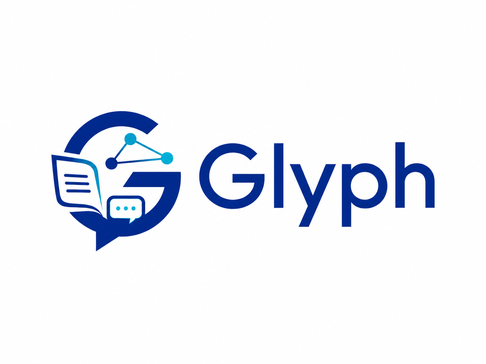
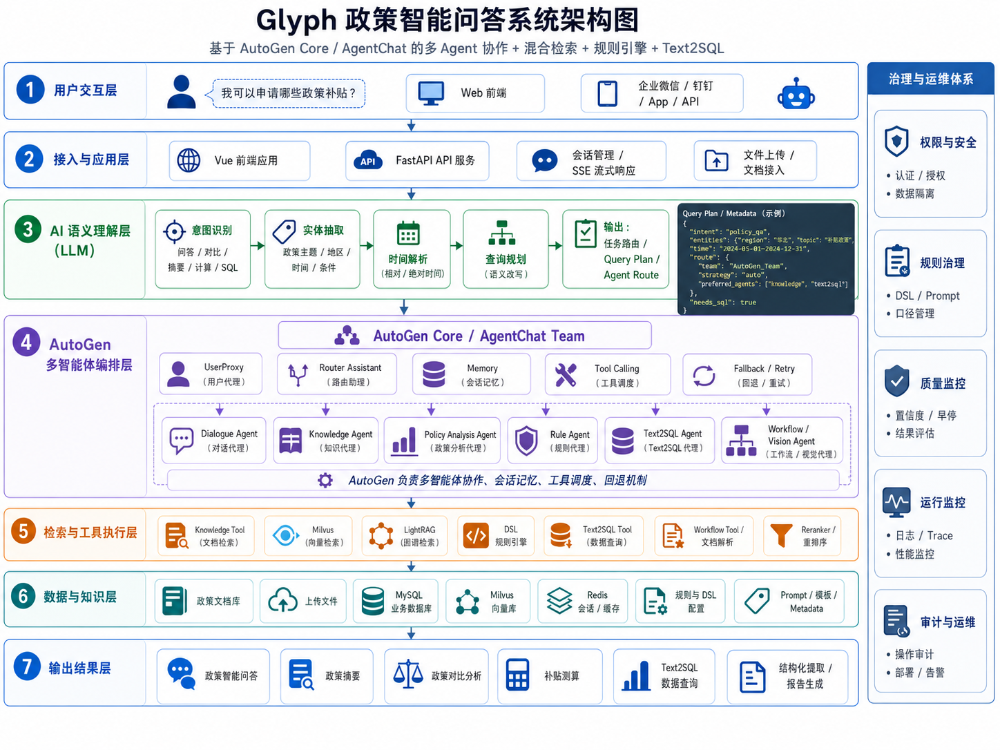

<div align="center">
  
</div>

## 政务咨询聊天助手

相关技术方案曾支持国家级赛事获奖项目。

## 项目简介

Glyph 面向政务咨询、政策服务、消费补贴、以旧换新、消费券等业务场景，提供统一的政策问答与测算能力。用户可以直接询问“我是否符合条件”“能补多少钱”“怎么办理”“需要哪些材料”“最近有哪些相关政策”等问题，系统会结合政策文档、FAQ、规则配置和结构化数据给出答案。

项目重点覆盖政策检索、资格判断、补贴测算、流程问答、政策对比和结构化查询等场景。底层结合多 Agent 编排、向量检索、图谱增强、YAML DSL 规则引擎与 Text2SQL，使回答既能贴近业务口径，也具备可追溯和可扩展性。

### 核心能力

- **政策问答** - 回答政策内容、适用范围、办理流程、所需材料、截止时间等问题
- **资格判断** - 结合地区、品类、价格、能效等条件判断是否符合申报或领取要求
- **补贴测算** - 基于规则引擎计算补贴金额、消费券档位、封顶金额等结果
- **政策检索** - 融合向量检索、图谱检索和规则匹配，提升政策召回与定位效率
- **政策对比** - 对不同政策的条件、金额、时间和适用对象进行横向比较
- **结构化查询** - 支持自然语言转 SQL，直接查询政策库和业务库中的结构化数据
- **接口集成** - 提供 RESTful API、CLI 和前端页面，方便接入现有业务系统

## 系统架构

<div align="center">
  
</div>

系统围绕“咨询入口 -> 智能路由 -> 检索/规则/查询执行 -> 结果输出”这条主链路展开，兼顾政策问答、补贴测算和结构化查询三类核心场景。

- **用户入口** - 支持 Web 前端、API、CLI 等多种接入方式，统一承接政务咨询与政策服务请求。
- **智能编排** - 由 AgentService 与 AgentChat Team 负责意图识别、路由决策、会话记忆和工具调度。
- **执行链路** - 按问题类型分别走知识检索、规则引擎、Text2SQL 或工作流处理。
- **数据底座** - 以政策文档、FAQ、DSL 规则、MySQL、Milvus、LightRAG 等数据源支撑回答和计算结果。

---

## 功能特性

### 1. 智能路由系统

```
用户查询 → 意图识别 → 智能路由 → 专业Agent → 答案生成
```

支持的意图类型：
- **政策查询** (`policy_inquiry`) - 资格、流程、截止日期等
- **政策对比** (`comparison`) - 多个政策的对比分析
- **政策摘要** (`summary`) - 政策概述与关键信息提取
- **金额计算** (`calculation`) - 补贴金额估算
- **数据查询** (`database_query`) - SQL数据库查询
- **对话交互** (`chit_chat`) - 问候、闲聊等

### 2. 多引擎检索

| 引擎 | 适用场景 | 技术栈 |
|------|---------|--------|
| **向量检索** | 语义相似度查询 | Milvus + OpenAI/DashScope Embeddings |
| **图谱检索** | 关系推理、概念关联 | LightRAG (Neo4j-like graph) |
| **规则引擎** | 确定性计算、条件判断 | YAML DSL + PolicyEngine |
| **SQL查询** | 结构化数据查询 | ChatDB (Text2SQL) |

**智能早停机制** ⚡:
- **触发条件**: 向量检索置信度 ≥ 80% (可配置 `EARLY_STOP_CONF`)
- **优化效果**: 跳过重排序和深度分析,直接生成答案
- **性能提升**: 响应时间减少 30-50%,API 调用成本降低
- **质量保证**: 仅对高置信度检索结果启用,确保答案准确性

```python
# 示例：高置信度查询触发早停
查询: "家电以旧换新补贴标准是多少？"
检索置信度: 92% ✅
→ 早停触发,跳过重排序
→ 直接生成答案 (节省 ~0.8s)
```

### 3. Agent 架构（新版 AgentChat 主路径）

- **入口**：问候/FAQ 快速分支 → Dialogue 或直接返回。
- **主干**：AgentChat Team（UserProxy + Router Assistant），Router 仅做“选 1 个工具并回答”：`knowledge_tool`（知识检索）、`rule_tool`（补贴计算）、`text2sql_tool`（数据库查询）、`workflow_tool`（多模态/档案）。
- **记忆**：AutoGen `ListMemory + BufferedChatCompletionContext` 唯一来源；支持 `MEMORY_MAX_ITEMS`、`MEMORY_TRUNCATE_CHARS`，以及 Redis 持久化（`AGENTCHAT_REDIS_URL`/`REDIS_URL`）。
- **回退**：Team 失败时可选 Router 兜底；如设 `AGENTCHAT_NO_FALLBACK=true`，失败直接报错，不再走旧链路。
- **输出**：`metadata.agentchat_meta` 带耗时、tool traces、memory_key、stop_reason；`timings_ms` 保留分段耗时。
- **流式**：`AGENTCHAT_STREAM_ENABLED=true` 时 SSE 先推 chunk 再推最终答案。

调优建议：
- 模型与上下文：用较快模型（如 qwen-plus），调整 `LLM_CTX_BUFFER_SIZE`、`KNOWLEDGE_MAX_CONTEXT_PER_DOC` 控制上下文长度。
- 记忆持久化：设置 Redis URL 并按需配置 `AGENTCHAT_REDIS_NAMESPACE`、`AGENTCHAT_REDIS_TTL_SECONDS`；默认即启用 AgentChat Team/Router（`.env.example` 已打开开关）。

### 路由决策（从快到稳）

1) FAQ 短路（无需改写/模型）
- 原始问题命中 FAQ（标签包含或相似度≥FAQ_THRESHOLD）→ 直接返回。
- 可选：改写后再试一次（`FAQ_RETRY_ON_REWRITE=true`）。

2) 预处理（仅在不命中 FAQ 时）
- 最近 N 轮上下文（N=CONVERSATION__HISTORY_WINDOW，0 表示关闭记忆）。
- Rewrite 业务化改写（短句/具槽位直返；带 LRU 缓存）。

3) FastPath 路由（不调意图模型，能判就判）
- 有图片/票据且 Vision 开启 → Workflow。
- SQL 关键词 且 有 connection_id → Text2SQL。
- “是否符合/能否享受/是否有资格…” 且缺“类别/能效/价格” → Clarifier（三要素清单）。
- 同时包含“补贴/补助”+ 家电品类 + “价格（…元）” + “能效/水效” → RuleEngine（直接计算）。
- 关系/流程/脉络 → GraphAgent。否则再调用 LLM 意图分类。

4) 检索/生成与早停
- Knowledge：Milvus/LlamaIndex → 置信度≥EARLY_STOP_CONF 先走“要点抽取⚡”，否则再一次 LLM 总结。
- RuleEngine：YAML DSL 计算（输出 trace/封顶校验）。
- Text2SQL：表结构检索→SQL 生成→安全校验（仅 SELECT）→执行。
- Graph/Workflow：按场景执行，失败回退 Knowledge。

5) 统一后处理
- 每条答案尾部统一追加“【路由】xxx”“【引用】…”。metadata 附 routing_debug、domain_context、rule_id/sql/search_query 等。

### FAQ 策略（优先短路）

- 命中即答：先用“原始问题”匹配 FAQ，若标签包含命中或相似度 ≥ `FAQ_THRESHOLD`（默认 0.85），直接返回，不走改写/意图/检索。
- 改写后重试（可选）：`FAQ_RETRY_ON_REWRITE=true` 时，原文未命中才对“改写后问题”再尝试一次（提升口语化问法命中率）。
- 标签来源与维护：严格从 `resources/data/process` 文档抽取关键词作为 tags。若需要更新，可手动编辑 `resources/faq/qa_pairs.json`，确保引用真实文档语句，避免臆造。
- 适用场景：固定问法（“发放时间/面额/领取与使用/资料清单/有效期/封顶金额/是否可再次享受” 等）优先挂到 FAQ，减少大模型调用与响应时延。

### 可配置项（.env）

- `FAQ_THRESHOLD=0.85`：FAQ 相似度阈值。
- `FAQ_RETRY_ON_REWRITE=true`：改写后再试一次 FAQ。
- `CONVERSATION__HISTORY_WINDOW=5`：上下文窗口（轮数），设 0 关闭记忆。
- `EARLY_STOP_CONF=0.80`：知识检索早停阈值（≥ 阈值先走“要点抽取⚡”）。
- `WEB_SEARCH__ENABLED=false`：禁用联网兜底（更快更稳）。
- `SYSTEM__HYBRID_RETRIEVAL_ENABLED=true`：启用分级检索（需要本地索引）。

### 多轮对话记忆（可开关）

- 目的：让追问更连贯（类似 ChatGPT），例如“我是否符合？”→“二级能效空调 8000 元。”→“怎么办理？”。
- 策略：仅拼接“最近 N 轮≈2N 条消息”摘要到改写提示，避免提示过长与幻觉；
- 配置：`CONVERSATION__HISTORY_WINDOW=N`（默认 5；设 0 关闭记忆）。

### 延迟与成本优化
- 最少调用原则：FastPath + Rewrite 缓存 + 知识早停，能不用模型就不用。
- 控制上下文长度：仅拼接最近 N 轮，避免超长提示引发幻觉与耗时。
- 只允许安全 SQL：拒绝 DML/DDL/多语句/UNION，降低数据库风险与执行时间。


**14个核心Agent及其分工**:

| Agent | 功能 | 输出 |
|-------|------|------|
| **RewriteAgent** | 查询标准化与改写 | 结构化查询 |
| **IntentRouter** | 意图识别与路由决策 | 路由目标+置信度 |
| **DialogueAgent** | 闲聊、问候等对话交互 | 对话回复 |
| **KnowledgeAgent** | 向量检索+重排+政策分析 | 结构化政策信息 |
| **GraphAgent** | LightRAG图谱推理 | 实体关系网络 |
| **RuleEngine** | YAML DSL规则计算 | 补贴金额/资格判断 |
| **Text2SQLAgent** | 自然语言→SQL→执行 | 数据库查询结果 |
| **WorkflowAgent** | 多Agent并行协调 | 融合多源结果 |
| **PolicyAnalyzer** | 政策要素提取 | 资格/流程/金额/时间 |
| **PolicyComparator** | 多政策对比分析 | 对比表格 |
| **AnswerGenerator** | 答案生成与优化 | 最终答案+置信度 |
| **QueryAnalyzer** | 查询深度分析 | 查询特征向量 |
| **Clarifier** | 澄清与歧义消解 | 澄清问题 |
| **QuestionBuilder** | 问题构建 | 结构化问题 |

---

## 快速开始

### 环境要求

- Python 3.10
- Docker / Docker Compose（推荐）
- Conda 或 Miniconda（本地开发时需要）
- Node.js 18+（仅本地调试前端时需要）
- 8GB 以上内存

> 推荐把依赖服务交给 Docker，应用本身根据需求选择“全 Docker”或“本地 conda 开发”两种方式。

### 方式一：Docker 一键运行（推荐）

适合首次体验、演示和快速拉起完整环境。

1. **克隆代码**
   ```bash
   git clone https://github.com/skygazer42/Glyph.git
   cd Glyph
   ```

2. **准备配置**
   ```bash
   cp .env.example .env
   ```
   至少补齐以下配置：
   - `LLM_API_KEY` / `LLM_BASE_URL` / `LLM_MODEL_NAME`
   - `EMBEDDING_BACKEND` 及对应 API Key

3. **启动完整服务**
   ```bash
   docker compose up -d --build web
   ```

4. **访问与检查**
   - 前端：http://localhost:8080
   - 后端健康检查：http://localhost:8000/api/health

5. **说明**
   - `api` 容器首次启动时会自动执行初始化：建表、Text2SQL 种子、schema 同步、Milvus 文档嵌入、LightRAG 种子导入。
   - 容器内使用 `/app/.initialized` 标记避免重复导入。
   - 如需改前端端口，可修改 `docker-compose.yaml` 中 `web` 服务的 `ports`，例如改为 `"3000:80"`。
   - 如需手动重建数据：
     ```bash
     docker compose exec api bash -c "\
       rm -f /app/.initialized && \
       python scripts/1_create_tables.py && \
       python scripts/2_seed_mysql_text2sql.py && \
       python scripts/7_sync_text2sql_schema.py && \
       python scripts/5_embed_process_documents.py --input-dir resources/data/process && \
       python scripts/6_seed_lightrag.py --input-dir resources/data/process"
     ```

### 方式二：本地开发

适合需要改 Python 代码、调试接口或单独运行前端的场景。推荐做法是：**Docker 起依赖服务，conda 跑应用本身**。

1. **克隆代码**
   ```bash
   git clone https://github.com/skygazer42/Glyph.git
   cd Glyph
   ```

2. **创建 conda 环境并安装依赖**
   ```bash
   conda create -n glyph python=3.10 -y
   conda activate glyph
   pip install -r requirements.txt
   ```

3. **准备 `.env`**
   ```bash
   cp .env.example .env
   ```
   本地开发时，至少确认这些配置与 Docker 依赖服务一致：
   ```bash
   DATABASE__MYSQL_HOST=localhost
   DATABASE__MYSQL_PORT=3307
   DATABASE__MYSQL_USER=root
   DATABASE__MYSQL_PASSWORD=mysql
   DATABASE__MYSQL_DB=policy_db

   DATABASE__MILVUS_HOST=localhost
   DATABASE__MILVUS_PORT=19530

   REDIS_URL=redis://localhost:6379/0
   AGENTCHAT_REDIS_URL=redis://localhost:6379/0
   SECURITY__RATE_LIMIT_REDIS_URL=redis://localhost:6379/0
   ```
   同时补齐：
   - `LLM_API_KEY` / `LLM_BASE_URL` / `LLM_MODEL_NAME`
   - `EMBEDDING_BACKEND` 及对应 API Key

4. **启动依赖服务**
   ```bash
   docker compose up -d mysql redis milvus
   ```
   这会同时拉起：
   - MySQL 8.0，宿主机端口 `3307`
   - Redis，宿主机端口 `6379`
   - Milvus，宿主机端口 `19530`

5. **初始化数据**
   ```bash
   bash scripts/init_data.sh
   ```
   该脚本会完成建表、Text2SQL 数据准备、schema 同步、Milvus 文档嵌入，以及 LightRAG 种子导入。

6. **启动后端 API**
   ```bash
   python -m uvicorn api_server:app --reload --env-file .env
   ```

7. **启动前端（可选）**
   ```bash
   npm --prefix web install
   npm --prefix web run dev
   ```

### 常用验证

1. **健康检查**
   ```bash
   curl http://localhost:8000/api/health
   ```

2. **检查数据库是否已初始化**
   ```bash
   mysql -h 127.0.0.1 -P 3307 -uroot -pmysql -D policy_db -e "SHOW TABLES;"
   ```

3. **手动接口检查**
   ```bash
   curl -X POST http://localhost:8000/api/agent/chat \
     -H "Content-Type: application/json" \
     -d '{"message": "家电以旧换新的补贴标准是什么？", "session_id": "demo"}'
   ```

4. **CLI 快速验证**
   ```bash
   python scripts/unified_cli.py --interactive
   ```

5. **自动化测试**
   ```bash
   pytest tests -q
   ```

---

## 配置说明

### 完整 .env 配置

```bash
# ==================== LLM 配置 ====================
LLM_API_KEY=sk-xxx
LLM_BASE_URL=https://api.deepseek.com
LLM_MODEL_NAME=deepseek-chat
LLM_TEMPERATURE=0
LLM_MAX_TOKENS=4000
LLM_TIMEOUT=120

# ==================== 嵌入配置 ====================
# 向量检索嵌入 (KnowledgeTool)
EMBEDDING_BACKEND=openai  # openai | dashscope
EMBEDDING_OPENAI_API_KEY=sk-xxx
EMBEDDING_OPENAI_MODEL=text-embedding-3-small
EMBEDDING_DASHSCOPE_API_KEY=sk-xxx
EMBEDDING_DASHSCOPE_MODEL=text-embedding-v3

# LightRAG 嵌入 (GraphAgent)
EMBEDDING_DASHSCOPE_API_KEY=sk-xxx
EMBEDDING_DASHSCOPE_DIMENSION=1024

# ==================== Reranker 配置 (可选) ====================
RERANKER_BACKEND=dashscope
DASHSCOPE_API_KEY=sk-xxx
RERANKER_MODEL=gte-rerank-v2
RERANKER_TOP_N=5
RERANKER_STRATEGY=replace  # replace | fuse

# ==================== Milvus 配置 ====================
DATABASE__MILVUS_HOST=localhost
DATABASE__MILVUS_PORT=19530
DATABASE__MILVUS_COLLECTION_NAME=policy_documents
DATABASE__MILVUS_USER=
DATABASE__MILVUS_PASSWORD=
DATABASE__MILVUS_DB_NAME=default
DATABASE__MILVUS_USE_SECURE=false

# ==================== MySQL 配置 ====================
DATABASE__MYSQL_HOST=localhost
DATABASE__MYSQL_PORT=3307
DATABASE__MYSQL_USER=root
DATABASE__MYSQL_PASSWORD=mysql
DATABASE__MYSQL_DB=policy_db

# ==================== LightRAG 配置 ====================
LIGHTRAG_WORKDIR=resources/data/lightrag
LIGHTRAG_QUERY_MODE=hybrid  # naive | local | global | hybrid
LIGHTRAG_EMBED_RETRY=3

# ==================== 多轮对话配置 ====================
CONVERSATION__MAX_TURNS=20
CONVERSATION__HISTORY_WINDOW=5

# ==================== 性能优化配置 ====================
EARLY_STOP_CONF=0.80  # 早停置信度阈值
ANALYZER_CONCURRENCY=3  # 政策分析并发数
```

---

## 性能优化

### 1. 向量检索优化

```python
# 使用 Reranker 提升准确率
RERANKER_BACKEND=dashscope
RERANKER_STRATEGY=fuse  # 融合向量分数和重排分数
RERANK_WEIGHT=0.7
FAISS_WEIGHT=0.3
```

### 2. LightRAG 优化

```bash
# 选择合适的查询模式
LIGHTRAG_QUERY_MODE=hybrid  # 混合模式，平衡速度和准确率
```

### 3. 并发控制

```python
# 限制分析并发数，避免API限流
ANALYZER_CONCURRENCY=3
```

---

## 测试

### 运行测试套件

```bash
# 单元测试
pytest tests/

# 集成测试
pytest tests/integration/

# Agent场景测试
python test_agent_scenarios.py

# LightRAG检索测试
python test_lightrag_retrieval.py
```

### 测试报告

查看 `AGENT_TEST_REPORT.md` 获取最新测试结果。

---

## 部署指南

### Docker 部署

```bash
# 构建镜像
docker build -t glyph-policy-qa:latest .

# 启动服务
docker run -d \
  -p 8000:8000 \
  --env-file .env \
  --name glyph-api \
  glyph-policy-qa:latest
```

### 生产环境建议

1. **使用 Gunicorn/Uvicorn workers**:
```bash
gunicorn app.main:app \
  --workers 4 \
  --worker-class uvicorn.workers.UvicornWorker \
  --bind 0.0.0.0:8000
```

2. **Nginx 反向代理**:
```nginx
upstream glyph_api {
    server 127.0.0.1:8000;
}

server {
    listen 80;
    server_name your-domain.com;

    location / {
        proxy_pass http://glyph_api;
        proxy_set_header Host $host;
        proxy_set_header X-Real-IP $remote_addr;
    }
}
```

3. **监控与日志**:
- 使用 Prometheus + Grafana 监控
- 集成 ELK/Loki 日志系统
- 配置健康检查端点 `/health`

---

## 开发指南

### 添加新的 Agent

1. **创建 Agent 类**:

```python
# app/agents/packs/my_agent/node.py
from app.agents.framework.base.base_agent import PolicyAgentBase
from app.models.base import AgentType, MessageType

class MyCustomAgent(PolicyAgentBase):
    def __init__(self):
        super().__init__(
            agent_type=AgentType.CUSTOM,
            name="MyCustomAgent",
            description="自定义Agent功能描述"
        )

    async def _handle_user_query(self, message, ctx):
        # 处理用户查询
        return result

    async def _handle_query_analysis(self, message, ctx):
        # 处理查询分析
        return result
```

2. **注册到 AgentService**:

```python
# app/agents/service/agent_service.py
from app.agents.packs.my_agent.node import MyCustomAgent

class AgentService:
    def __init__(self):
        # ...
        self.my_custom_agent = MyCustomAgent()
```

3. **添加路由规则**:

```python
# app/agents/service/agent_service.py
def _resolve_route(self, intent_result, ...):
    if intent == "my_custom_intent":
        return "my_custom"
    # ...
```

### 添加新的意图

```python
# app/models/base.py
class QueryIntent(str, Enum):
    # 现有意图...
    MY_CUSTOM_INTENT = "my_custom_intent"
```

### 添加新的 DSL 规则

```yaml
# resources/dsl/rules/my_policy.yaml
policy_meta:
  id: Rule_MyPolicy_2025
  name: 自定义政策规则

eligibility:
  conditions:
    - field: age
      operator: ">="
      value: 18

calculation:
  rules:
    - condition: income < 50000
      formula: "base_amount * 1.5"
```

---

## 维护工具

### 清理临时文件

```bash
# 预览将删除的文件
bash scripts/clean.sh

# 实际执行清理
bash scripts/clean.sh --no-dry-run --yes
```

### 数据库维护

```bash
# 备份 MySQL
mysqldump -u root -p policy_qa > backup.sql

# 重建 Milvus collection
python scripts/rebuild_milvus.py
```

---

## 已知问题

### LightRAG 嵌入函数异步问题

**问题**: LightRAG 文档处理时出现 `TypeError: object list can't be used in 'await' expression`

**影响**: 部分文档的高级处理（知识图谱构建）失败，但基础检索功能正常

**状态**: 已识别，待修复

**解决方案**: 将嵌入函数改为异步函数

### 路由逻辑限制

**问题**: 当前只有 `summary` 意图才会路由到 LightRAG

**影响**: LightRAG 未被充分利用

**建议**: 扩展路由条件，将更多政策查询路由到 graph

---

## Roadmap

- [ ] 修复 LightRAG 异步嵌入问题
- [ ] 优化路由策略，提升 LightRAG 使用率
- [ ] 增加政策对比的可视化展示
- [ ] 支持多租户与权限管理
- [ ] 添加政策变更监控与通知
- [ ] 开发管理后台
- [ ] 支持更多数据源（PDF、Excel等）

---

## 贡献指南

我们欢迎所有形式的贡献！

### 贡献流程

1. Fork 本项目
2. 创建特性分支 (`git checkout -b feature/AmazingFeature`)
3. 提交变更 (`git commit -m 'Add some AmazingFeature'`)
4. 推送到分支 (`git push origin feature/AmazingFeature`)
5. 创建 Pull Request

### 代码规范

- 遵循 PEP 8
- 添加类型注解
- 编写单元测试
- 更新文档

---

## 许可证

本项目采用 MIT 许可证 - 详见 [LICENSE](LICENSE) 文件

---

## 致谢

- [AutoGen](https://github.com/microsoft/autogen) - 多Agent协作框架
- [LightRAG](https://github.com/HKUDS/LightRAG) - 轻量级知识图谱检索
- [Milvus](https://milvus.io/) - 向量数据库
- [FastAPI](https://fastapi.tiangolo.com/) - 现代Web框架
- [DeepSeek](https://www.deepseek.com/) - 大语言模型

---

 
 
<div align="center">


Made with care by the Glyph Team

</div>
