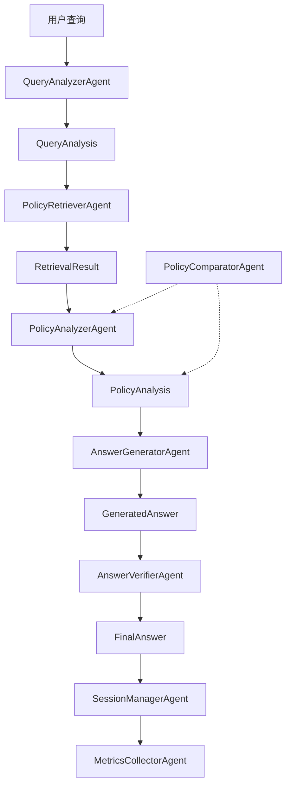

# Gove Agent系统架构说明

## 概述

本文档描述了gove政策智能问答系统的agent架构优化方案。参考003项目chatdb模块的模块化设计，我们将实现一个更加清晰、可维护、可扩展的agent系统。

## 目录结构

```
agents/
├── __init__.py              # 模块导出
├── README.md               # 本文档
├── base/                   # 基础模块
│   ├── __init__.py
│   ├── base_agent.py       # 基础agent类
│   ├── factory.py          # Agent工厂
│   └── types.py            # 类型定义
├── retrieval/              # 检索模块
│   ├── __init__.py
│   ├── query_analyzer.py   # 查询理解agent
│   ├── policy_retriever.py # 政策检索agent
│   ├── vector_retriever.py # 向量检索agent
│   └── embedding_manager.py # 嵌入管理器
├── analysis/               # 分析模块
│   ├── __init__.py
│   ├── policy_analyzer.py  # 政策分析agent
│   ├── requirement_extractor.py # 需求提取agent
│   └── policy_comparator.py # 政策比较agent
├── generation/             # 生成模块
│   ├── __init__.py
│   ├── answer_generator.py # 答案生成agent
│   ├── question_understander.py # 问题理解agent
│   └── template_manager.py # 模板管理器
├── verification/           # 验证模块
│   ├── __init__.py
│   ├── answer_verifier.py  # 答案验证agent
│   ├── fact_checker.py     # 事实核查agent
│   └── consistency_checker.py # 一致性检查agent
├── coordination/           # 协调模块
│   ├── __init__.py
│   ├── coordinator.py      # 协调器
│   ├── session_manager.py  # 会话管理器
│   └── workflow_manager.py # 工作流管理器
└── monitoring/             # 监控模块（新增）
    ├── __init__.py
    ├── metrics_collector.py # 指标收集器
    ├── performance_monitor.py # 性能监控器
    └── error_tracker.py    # 错误追踪器
```

## Agent职责说明

### 1. 查询理解层（Query Understanding Layer）

#### QueryAnalyzerAgent
- **职责**: 分析用户查询，识别意图
- **输入**: 用户查询文本
- **输出**: QueryAnalysis（意图、实体、关键词）
- **功能**:
  - 意图识别（ELIGIBILITY_CHECK, BENEFIT_CALCULATION等）
  - 实体提取（部门、地区、时间等）
  - 关键词提取
  - 查询扩展

### 2. 检索层（Retrieval Layer）

#### PolicyRetrieverAgent
- **职责**: 根据分析结果检索相关政策
- **输入**: QueryAnalysis
- **输出**: RetrievalResult（相关文档列表）
- **功能**:
  - 向量检索
  - 关键词检索
  - 混合检索
  - 结果排序和过滤

#### VectorRetrieverAgent
- **职责**: 管理向量索引和检索
- **功能**:
  - 文档向量化
  - FAISS索引管理
  - 相似度计算
  - 批量处理

### 3. 分析层（Analysis Layer）

#### PolicyAnalyzerAgent
- **职责**: 深度分析政策文档内容
- **输入**: 政策文档和查询上下文
- **输出**: PolicyAnalysis
- **功能**:
  - 提取申请条件
  - 提取补贴标准
  - 提取申请流程
  - 提取时间节点
  - 提取联系方式

#### PolicyComparatorAgent（新增）
- **职责**: 比较多个政策文件的差异
- **功能**:
  - 并行分析多个文档
  - 识别相同点和不同点
  - 生成对比表格
  - 提供比较摘要

### 4. 生成层（Generation Layer）

#### AnswerGeneratorAgent
- **职责**: 基于分析结果生成答案
- **输入**: 分析结果集合
- **输出**: GeneratedAnswer
- **功能**:
  - 模板化答案生成
  - 多意图处理
  - 引用管理
  - 置信度评估

### 5. 验证层（Verification Layer）

#### AnswerVerifierAgent
- **职责**: 验证答案的准确性和一致性
- **功能**:
  - 事实核查
  - 一致性检查
  - 置信度验证
  - 质量评分

### 6. 协调层（Coordination Layer）

#### CoordinatorAgent
- **职责**: 协调各agent的工作流程
- **功能**:
  - Agent间通信
  - 工作流编排
  - 错误处理
  - 状态管理

#### SessionManagerAgent（新增）
- **职责**: 管理用户会话和上下文
- **功能**:
  - 会话状态维护
  - 上下文管理
  - 历史记录
  - 多轮对话支持

### 7. 监控层（Monitoring Layer）- 新增

#### MetricsCollectorAgent
- **职责**: 收集系统运行指标
- **功能**:
  - 性能指标收集
  - 使用统计
  - 错误率统计
  - 生成报告

## 工作流程



## 设计原则

1. **单一职责**: 每个agent只负责一个特定功能
2. **松耦合**: Agent间通过消息通信，不直接依赖
3. **高内聚**: 相关功能集中在同一模块
4. **可扩展**: 易于添加新的agent类型
5. **可测试**: 每个agent可独立测试
6. **可监控**: 完整的日志和指标收集

## 配置管理

通过config.yaml管理agent配置：

```yaml
agents:
  query_analyzer:
    enabled: true
    model: deepseek-chat
    max_tokens: 1000
    temperature: 0.1

  policy_retriever:
    enabled: true
    top_k: 10
    threshold: 0.7
    retrieval_method: hybrid

  answer_generator:
    enabled: true
    templates_path: templates/
    max_sources: 5
```

## 性能优化

1. **并发处理**: 异步执行多个agent
2. **缓存机制**: 缓存常见查询结果
3. **批量处理**: 支持批量文档分析
4. **流式处理**: 支持流式响应输出

## 错误处理

1. **优雅降级**: 单个agent失败不影响整体流程
2. **重试机制**: 支持自动重试
3. **错误追踪**: 完整的错误日志和追踪
4. **用户友好**: 提供清晰的错误提示

## 测试策略

1. **单元测试**: 每个agent独立测试
2. **集成测试**: 测试agent间协作
3. **端到端测试**: 测试完整流程
4. **性能测试**: 测试响应时间和吞吐量