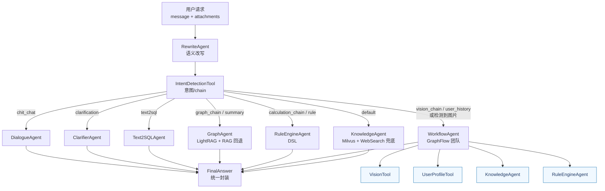

# Agent 模块指南

## 目标

为了满足“所有智能体逻辑集中在 `app/agents/`、统一的路由服务、可复用的 pack 模式”这三个要求，我们将原有的多层 orchestration 与 `app/services` 目录全部收敛到以下结构，确保：

1. **单一入口**：`AgentService` 提供改写 → 意图识别 → 路由执行的标准流水线，API/CLI 全部调用它。
2. **轻量 packs**：每个智能体打包在 `packs/<agent_name>/`，统一 `node.py + prompt.py + utils.py`（可选），目录清晰。
3. **复用内核**：`framework/` 保留 AutoGen 基座能力，`pipeline/` 封装对外暴露的服务级 Agent（Rewrite/Knowledge/Text2SQL 等）。

## 目录总览

```
app/agents/
├── ag_builder.py         # 轻量 AG 组合器 Demo（原 simple_controller）
├── ag_prompt.py          # Workflow 共用的提示词
├── ag_workflow.py        # AutoGen Workflow Demo（原 ag_orchestrator）
├── framework/            # AutoGen Core 抽象：BaseAgent、会话、监控、安全等
├── packs/                # 「一个 Agent = 一个目录」的实现，示例：chat_agent、graph_retriever
├── pipeline/             # AgentService 使用的业务流水线代理（Rewrite/Knowledge/Graph/Rule/Text2SQL）
├── dsl_generator/        # DSL 生成&执行引擎（PolicyEngine 等）
├── chatdb/               # Text2SQL 相关 Agent + 服务化工具
├── service/
│   ├── __init__.py
│   ├── agent_service.py  # ✅ 唯一对外 orchestrator，整合所有 Agent
│   └── tools.py          # 轻量工具集：IntentDetectionTool、KnowledgeTool
└── README.md             # 当前说明
```

> **提示**：老的 `app/services/`、`app/agents/core` 等目录已经废弃，所有 orchestration 逻辑都在本目录完成。



## AgentService 流水线

`AgentService.process_query()` 将任意用户问题标准化后，依次执行以下步骤：

1. **RewriteAgent**  
   - 位于 `pipeline/rewrite_agent.py`  
   - 使用 LLM 对原始输入进行语义重写，补全主体、口语化纠正。

2. **IntentDetectionTool**  
   - 位于 `service/tools.py`  
   - 输出 `intent`、`chains` 等标签，用于后续路由。

3. **路由策略**（实现在 `service/agent_service.py`）  
   - `dialogue`：ChatAgent（闲聊/寒暄）  
   - `clarify`：ClarifierAgent（追问信息）  
   - `knowledge`：KnowledgeAgent（Milvus 向量检索 + 摘要）  
   - `graph`：GraphAgent（LightRAG，可回落到知识库）  
   - `rule_engine`：RuleEngineAgent（DSL PolicyEngine 计算）  
   - `text2sql`：Text2SQLAgent（ChatDB pipeline，需要 `connection_id`）  
   - `workflow`：WorkflowAgent（GraphFlow，将多模态解析/用户资料查询→知识检索/规则计算→最终答复串成一个小团队）  

4. **结果包装**  
   - 所有 Agent 返回 `FinalAnswer`，`AgentService` 统一补充 `route / intent / session_id / latency` 等 metadata，方便 API、CLI、SSE 直接使用。

## packs 规范

每个智能体目录遵循“**三件套**”：

```
packs/<agent_name>/
├── __init__.py           # 暴露类
├── node.py               # 继承 PolicyAgentBase / ReactiveAgent 的核心逻辑
├── prompt.py             # 该 Agent 独有的 prompt 模板
└── utils.py (可选)       # 仅该 Agent 使用的辅助函数
```

当前重点 packs：

| 目录 | 功能 |
|------|------|
| `chat_agent/` | 日常问候/闲聊，模板化回复 |
| `clarifier/` | 追问缺失信息，输出结构化澄清 |
| `intent_router/` | LLM + 规则的意图路由辅助 |
| `graph_retriever/` | LightRAG 检索/知识图谱接口 |
| `policy_analysis/`、`policy_reviewer/` | 深度政策解析/对比（保留以备高级流程） |

> **继承要求**：若多个 Agent 共用基类，请放在 `framework/base/`；复用型工具集中维护在 `service/tools.py`，避免继续扩散新的“common”目录。

## Text2SQL 与 DSL

- **Text2SQL**  
  - 核心位于 `chatdb/`：`schema_retriever`, `hybrid_sql_generator`, `text2sql_service` 等。  
  - `pipeline/text2sql_agent.py` 将它们封装成 `FinalAnswer`，`AgentService` 通过 `connection_id` 自动激活。

- **DSL 规则计算**  
  - `dsl_generator/` 存放 DSL 模板、解析、引擎。  
  - `RuleEngineAgent`（`pipeline/rule_agent.py`）通过 `PolicyEngine` 执行 YAML 规则，保证所有计算场景统一复用 DSL。

## 知识库 / RAG

- `KnowledgeService` (`app/knowledge/service.py`) 统一负责 Milvus 入库与检索。  
- `KnowledgeAgent` 依赖 `KnowledgeTool`（位于 `service/tools.py`），并可选挂载 `WebSearchTool`（Tavily）在知识库为空时自动联网兜底，因此 GraphAgent、外部脚本可以按需复用。  
- 通过 `.env` 中的 `WEB_SEARCH__*`（例如 `WEB_SEARCH__SITE_FILTER`）可限制联网兜底的域名范围，方便锚定官方站点。
- 如需引入 LlamaIndex/LightRAG，自行封装在 pack 中，再由 `AgentService` 路由，而不是回到旧的 service 目录。

## 多模态 Workflow

- `.env` 新增 `VISION__*` 段（模型、Base URL、Prompt 等），由 `VisionTool` (`service/tools.py`) 统一读取，并在识别图片时生成 data-url 或直链。
- `AgentService.process_query()` 支持 `attachments`（API Schema 中同名字段），当检测到图片或意图为个人历史查询时，会路由至 `WorkflowAgent`。
- `WorkflowAgent` (`pipeline/workflow_agent.py`) 使用 AutoGen `GraphFlow` 组装 `vision_analyzer → task_router → answer_composer`，并通过 `FunctionTool` 调用 `VisionTool`、`UserProfileTool`（读取 `resources/data/user_profiles.json`）、`KnowledgeAgent`、`RuleEngineAgent`，可以实现“先解析图片/用户历史→再知识检索/DSL 计算”的链式处理。
- Workflow 产出的 `FinalAnswer.metadata` 中包含 `workflow` 字段（vision 摘要、下游路由痕迹），上层可据此展示多代理协作轨迹。

## API / CLI 的使用方式

```python
from app.agents.service import AgentService

service = AgentService()
await service.initialize()
answer = await service.process_query(
    "申请家电补贴需要什么条件？",
    session_id="demo",
    connection_id=None,
)
print(answer.answer, answer.metadata)
```

- FastAPI (`app/main.py`、`app/api/endpoints/agent.py`) 与 CLI (`scripts/unified_cli.py`) 均直接依赖 `AgentService`。
- 文档/示例中若仍提到 `app/services/*`，请更新为 `app/agents/service/`。

## 常见扩展指引

1. **新增 Agent**  
   - 在 `packs/<name>/` 新建目录 → 在 `node.py` 继承 `PolicyAgentBase`。  
   - 若需加入主流程，在 `pipeline/` 新增包装类，并在 `AgentService` 的路由表中调用。

2. **新增 DSL 规则**  
   - 使用 `dsl_generator` 生成 YAML → 放入 `rules/` → `PolicyEngine` 会自动加载。  
   - 如需测试，调用 `RuleEngineAgent.compute()`。

3. **知识库扩展**  
   - 通过 `AgentService.ingest_paths()` / `KnowledgeService.index_documents()` 完成增量入库。  
   - 如要接入 LightRAG，自行在 `GraphAgent` 内扩展，保持 `KnowledgeAgent` 为默认回退。

通过以上约束，`agents/` 目录保持“packs = 具体 Agent、pipeline = 服务包装、service = 单一入口”的清晰结构，方便 Docker 打包与自动化部署。欢迎在新增模块前先更新本文件，保持团队对目录语义的一致理解。
