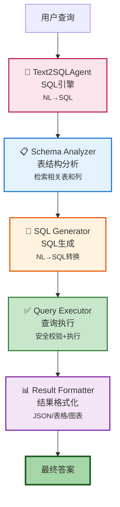

# Text2SQL Agent 模块

## 概述

Text2SQL Agent 是 Glyph 系统中负责将自然语言查询转换为 SQL 查询并执行的智能体模块。该模块实现了从自然语言理解到 SQL 生成、执行和结果格式化的完整流程。

## 架构流程

根据 README 架构图,Text2SQL Agent 的处理流程如下:



## 核心组件

### 1. Schema Analyzer (表结构分析器)

**文件**: `schema_retriever.py`

**功能**:
- 检索相关表结构
- 识别相关列和关系
- 提取表约束和索引信息

**核心方法**:
```python
async def retrieve_schema(query: str, connection_id: int) -> Dict[str, Any]:
    """
    根据查询检索相关的数据库表结构

    Args:
        query: 用户的自然语言查询
        connection_id: 数据库连接ID

    Returns:
        包含表结构、列信息、关系的字典
    """
```

**实现要点**:
- 使用向量相似度匹配相关表
- 检索表的列、类型、注释
- 识别主键、外键关系
- 过滤不相关的表,减少上下文噪声

### 2. SQL Generator (SQL生成器)

**文件**: `sql_generator.py`, `hybrid_sql_generator.py`

**功能**:
- 将自然语言转换为 SQL
- 支持领域特定优化
- 处理复杂查询(JOIN、聚合、子查询)

**核心方法**:
```python
async def generate_sql(
    query: str,
    schema_context: Dict[str, Any],
    domain_hints: Optional[Dict[str, Any]] = None
) -> str:
    """
    基于自然语言查询和表结构生成SQL

    Args:
        query: 用户查询
        schema_context: 表结构上下文
        domain_hints: 领域提示(时间范围、聚合类型等)

    Returns:
        生成的SQL查询语句
    """
```

**增强特性**:
- **领域感知**: 支持政府政策领域的特定术语映射
- **时间解析**: 自动识别"最近3个月"等时间表达
- **值映射**: 将自然语言术语映射到数据库值
- **混合生成**: 结合规则和LLM生成SQL

### 3. Query Executor (查询执行器)

**文件**: `sql_executor.py`

**功能**:
- 安全校验 SQL
- 执行查询
- 处理错误和超时

**核心方法**:
```python
async def execute_sql(
    sql: str,
    connection_id: int,
    timeout: int = 30
) -> Dict[str, Any]:
    """
    安全执行SQL查询

    Args:
        sql: 待执行的SQL
        connection_id: 数据库连接ID
        timeout: 超时时间(秒)

    Returns:
        查询结果和元数据
    """
```

**安全措施**:
- ✅ **仅允许 SELECT**: 拒绝 DML/DDL 操作
- ✅ **SQL 注入防护**: 参数化查询
- ✅ **超时控制**: 防止长时间运行
- ✅ **结果集限制**: 防止返回过大数据
- ✅ **语法校验**: 解析 SQL 检查合法性

### 4. Result Formatter (结果格式化器)

**文件**: `visualization_recommender.py`, `sql_explainer.py`

**功能**:
- 格式化查询结果
- 生成可视化建议
- 解释 SQL 语义

**核心方法**:
```python
def format_result(
    query_result: Dict[str, Any],
    query: str,
    sql: str
) -> Dict[str, Any]:
    """
    格式化查询结果为用户友好的输出

    Args:
        query_result: SQL执行结果
        query: 原始用户查询
        sql: 生成的SQL

    Returns:
        格式化后的结果(表格/图表/文本)
    """
```

**输出格式**:
- **表格**: Markdown 表格或 JSON
- **图表**: 推荐合适的图表类型(折线图/柱状图/饼图)
- **解释**: SQL 语义的自然语言解释
- **元数据**: 执行时间、行数、列数

## 辅助组件

### Query Analyzer (查询分析器)

**文件**: `query_analyzer.py`

**功能**:
- 分析查询意图(统计/列表/聚合)
- 提取查询实体和时间范围
- 推断需要的表和列

### Domain Context (领域上下文)

**文件**: `domain_zh_gov.py`

**功能**:
- 政府政策领域的术语标准化
- 时间表达解析("近三个月"→日期范围)
- 地区名称规范化
- 政策类型映射

**核心功能**:
```python
def normalize_terms(query: str) -> str:
    """标准化政策领域术语"""

def parse_time_window(query: str) -> Optional[Dict[str, Any]]:
    """解析时间表达"""

def infer_intent(query: str) -> Dict[str, Any]:
    """推断查询意图"""
```

## 工作流程详解

### 1. 表结构分析阶段

```python
# 步骤1: 连接数据库,获取元数据
connection = get_connection(connection_id)
tables = get_all_tables(connection)

# 步骤2: 向量检索相关表
query_embedding = embed(query)
relevant_tables = vector_search(query_embedding, tables)

# 步骤3: 获取详细表结构
schema_context = {
    "tables": [],
    "relationships": []
}

for table in relevant_tables:
    columns = get_columns(table)
    constraints = get_constraints(table)
    schema_context["tables"].append({
        "name": table,
        "columns": columns,
        "constraints": constraints
    })
```

### 2. SQL 生成阶段

```python
# 步骤1: 领域增强
domain_hints = parse_domain_context(query)
# {
#   "time_window": {"start": "2024-10-01", "end": "2024-12-31"},
#   "aggregation": "COUNT",
#   "order_by": "desc_time"
# }

# 步骤2: 构建提示
prompt = construct_prompt(
    schema_context=schema_context,
    query=query,
    value_mappings=get_value_mappings(query),
    hints=domain_hints
)

# 步骤3: LLM 生成 SQL
sql = await llm_generate(prompt)

# 步骤4: 提取和清理 SQL
sql = extract_sql_from_llm_response(sql)
sql = clean_sql(sql)
```

### 3. 查询执行阶段

```python
# 步骤1: 安全校验
if not validate_sql(sql):
    raise SecurityError("不安全的SQL")

# 步骤2: 执行查询
try:
    result = await execute_query(
        sql=sql,
        connection_id=connection_id,
        timeout=30
    )
except Exception as e:
    return error_response(e)

# 步骤3: 记录执行日志
log_query_execution(query, sql, result)
```

### 4. 结果格式化阶段

```python
# 步骤1: 基础格式化
formatted = {
    "query": query,
    "sql": sql,
    "rows": result["data"],
    "row_count": len(result["data"]),
    "columns": result["columns"]
}

# 步骤2: 生成表格
formatted["table"] = to_markdown_table(result["data"])

# 步骤3: 可视化推荐
if should_visualize(result):
    chart_type = recommend_chart_type(result)
    formatted["visualization"] = {
        "type": chart_type,
        "config": generate_chart_config(result, chart_type)
    }

# 步骤4: 生成解释
formatted["explanation"] = explain_sql(sql)
```

## 配置项

### 环境变量

```bash
# Text2SQL 配置
TEXT2SQL__MAX_TABLES=5          # 最大检索表数
TEXT2SQL__MAX_COLUMNS=50        # 最大列数
TEXT2SQL__QUERY_TIMEOUT=30      # 查询超时(秒)
TEXT2SQL__MAX_ROWS=1000         # 最大返回行数
TEXT2SQL__ENABLE_CACHE=true     # 启用缓存
TEXT2SQL__CACHE_TTL=3600        # 缓存过期时间(秒)

# 安全配置
TEXT2SQL__ALLOW_DML=false       # 禁止 DML 操作
TEXT2SQL__ALLOW_DDL=false       # 禁止 DDL 操作
TEXT2SQL__ALLOW_UNION=false     # 禁止 UNION 查询
```

## 使用示例

### 基础查询

```python
from app.agents.chatdb.text2sql_service import Text2SQLService

service = Text2SQLService()

# 示例1: 简单查询
result = await service.query(
    query="有多少个政策文件？",
    connection_id=1
)
# SQL: SELECT COUNT(*) FROM policies;
# 结果: {"count": 42}

# 示例2: 带条件查询
result = await service.query(
    query="家电类政策有哪些？",
    connection_id=1
)
# SQL: SELECT title, publish_date FROM policies WHERE category = '家电' LIMIT 10;
# 结果: [{"title": "...", "publish_date": "2024-01-01"}, ...]
```

### 复杂查询

```python
# 示例3: 时间范围查询
result = await service.query(
    query="列出近三个月发布的政策标题及来源",
    connection_id=1
)
# SQL: SELECT title, source, publish_date FROM policies
#      WHERE publish_date >= DATE_SUB(CURDATE(), INTERVAL 3 MONTH)
#      ORDER BY publish_date DESC;

# 示例4: 聚合统计
result = await service.query(
    query="按政策类型统计数量",
    connection_id=1
)
# SQL: SELECT category, COUNT(*) as count FROM policies
#      GROUP BY category ORDER BY count DESC;
```

### 领域增强查询

```python
# 示例5: 政策领域查询
result = await service.query(
    query="济南市2025年家电补贴政策发放情况",
    connection_id=1
)
# 自动识别:
# - 地区: 济南市
# - 时间: 2025年
# - 类型: 家电补贴
# - 意图: 统计查询

# SQL: SELECT status, COUNT(*) as count, SUM(amount) as total
#      FROM subsidies
#      WHERE region = '济南市'
#        AND policy_type = '家电补贴'
#        AND year = 2025
#      GROUP BY status;
```

## 错误处理

### 常见错误类型

1. **SQL 生成失败**
```python
{
    "error": "sql_generation_failed",
    "message": "无法理解查询,请提供更具体的描述",
    "suggestion": "尝试包含表名或列名"
}
```

2. **安全校验失败**
```python
{
    "error": "unsafe_sql",
    "message": "检测到不安全的SQL操作: DROP TABLE",
    "rejected_sql": "DROP TABLE users;"
}
```

3. **执行超时**
```python
{
    "error": "query_timeout",
    "message": "查询执行超时(30秒)",
    "sql": "SELECT * FROM large_table JOIN ...",
    "suggestion": "添加 WHERE 条件减少数据量"
}
```

4. **表不存在**
```python
{
    "error": "table_not_found",
    "message": "表 'xxx' 不存在",
    "available_tables": ["policies", "subsidies", "regions"]
}
```

## 性能优化

### 1. Schema 检索优化

- **向量缓存**: 表结构嵌入缓存
- **增量更新**: 仅在表结构变更时重新索引
- **Top-K 限制**: 只检索最相关的 5 张表

### 2. SQL 生成优化

- **提示缓存**: 相似查询复用提示模板
- **规则优先**: 简单查询直接用规则生成,跳过 LLM
- **混合生成**: 规则框架 + LLM 填充细节

### 3. 执行优化

- **结果缓存**: 相同 SQL 缓存结果(可配置 TTL)
- **连接池**: 复用数据库连接
- **异步执行**: 支持并发查询

## 测试

### 单元测试

```bash
# 测试 Schema Retriever
pytest tests/test_schema_retriever.py

# 测试 SQL Generator
pytest tests/test_sql_generator.py

# 测试 Query Executor
pytest tests/test_sql_executor.py
```

### 集成测试

```bash
# 端到端测试
pytest tests/test_text2sql_e2e.py -v

# 性能测试
pytest tests/test_text2sql_performance.py --benchmark
```

### 测试覆盖率

```bash
pytest --cov=app/agents/chatdb --cov-report=html
```

## 最佳实践

### 1. 数据库设计

- ✅ 使用有意义的表名和列名
- ✅ 添加列注释(COMMENT)
- ✅ 规范命名约定(snake_case)
- ✅ 适当的索引设计

### 2. 查询优化

- ✅ 使用 LIMIT 限制返回行数
- ✅ 避免 SELECT *
- ✅ 合理使用索引列
- ✅ 时间范围查询使用索引

### 3. 安全措施

- ✅ 始终使用参数化查询
- ✅ 限制查询类型(仅 SELECT)
- ✅ 设置查询超时
- ✅ 结果集大小限制

### 4. 用户体验

- ✅ 提供清晰的错误提示
- ✅ 显示 SQL 让用户理解
- ✅ 推荐可视化方式
- ✅ 支持查询历史

## 未来优化

### 短期 (1-2周)

- [ ] 增强多表 JOIN 支持
- [ ] 优化复杂聚合查询
- [ ] 支持更多时间表达
- [ ] 改进错误提示

### 中期 (1-2月)

- [ ] 查询意图学习
- [ ] SQL 模板库
- [ ] 自动索引建议
- [ ] 查询性能分析

### 长期 (3-6月)

- [ ] 多数据库支持(PostgreSQL/MongoDB)
- [ ] 自然语言结果解释
- [ ] 交互式查询构建
- [ ] 查询优化建议

## 参考资料

- [SQL 安全最佳实践](https://owasp.org/www-community/attacks/SQL_Injection)
- [Text2SQL 论文合集](https://github.com/yechens/NL2SQL)
- [LlamaIndex SQL教程](https://docs.llamaindex.ai/en/stable/examples/query_engine/natural_language_sql_query_engine/)

## 贡献指南

欢迎贡献代码! 请确保:

1. 添加单元测试
2. 更新文档
3. 遵循代码规范
4. 通过所有测试

## 许可证

MIT License - 详见项目根目录 LICENSE 文件
