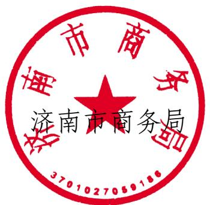
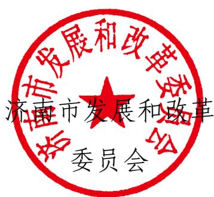
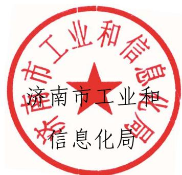
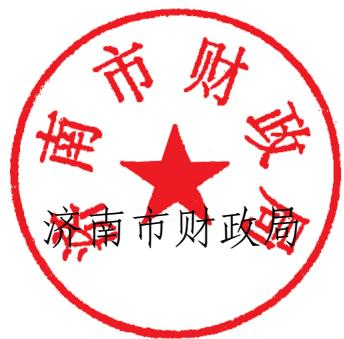
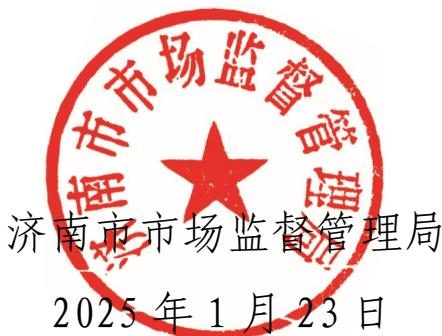

# 济南市商务局

# 济南市发展和改革委员会

# 济南市工业和信息化局

# 济南市财政局

# 济南市市场监督管理局

# 文件

济商务字〔2025〕6号

# 关于印发《济南市2025年手机、平板、智能

# 手表（手环）购新补贴实施细则》的通知

各区县（功能区）商务主管部门、发展改革委、工业和信息化局、财政局、市场监管局：

为落实《商务部等5部门办公厅关于印发<手机、平板、智能手表(手环)购新补贴实施方案>的通知》（商办流通函[2025]7号）、《山东省商务厅等5部门关于印发<山东省手机、平板、

智能手表（手环）购新补贴实施细则》的通知》（鲁商字〔2025〕2号）等文件要求，市商务局等5部门研究制定了《济南市2025年手机、平板、智能手表（手环）购新补贴实施细则》，现印发给你们，请抓好贯彻落实。

(此件公开发布)

# 济南市2025年手机、平板、智能手表（手环）购新补贴实施细则

根据《国家发展改革委 财政部关于2025年加力扩围实施大规模设备更新和消费品以旧换新政策的通知》（发改环资[2025]13号）、《商务部等5部门办公厅关于印发〈手机、平板、智能手表(手环)购新补贴实施方案〉的通知》（商办流通函[2025]7号）、《山东省商务厅等5部门关于印发〈山东省手机、平板、智能手表(手环)购新补贴实施细则〉的通知》（鲁商字[2025]2号）等文件要求，为做好我市2025年手机、平板、智能手表（手环）购新补贴工作，特制定本实施细则。

# 第一章 补贴时间、补贴范围和标准

# 第一条 补贴时间及范围

补贴时间自本细则印发之日起（含当日）启动，个人消费者购买手机、平板、智能手表（手环）3类数码产品（单件销售价格不超过6000元），可享受购新补贴。建立3类数码产品目录数据库，品牌、型号等实施动态调整。

# 第二条 补贴标准

补贴比例为减去生产、流通环节及移动通信运营商所有优惠后最终销售价格的  $15\%$  （产品最终销售价格以销售发票价税合

计金额为准），每件最高不超过500元，每人每类可补贴1件。

# 第二章 补贴规则及流程

# 第三条 平台机构

济南市“泉城购”服务平台是本次活动的服务平台机构。

# 第四条 补贴资格领取

个人消费者通过济南市“泉城购”服务平台，完成实名认证，根据需求领取补贴资格（实行总量控制），补贴资格须在2个自然日（即领取之日起至第二日的23:59:59）内使用，未使用的自动失效，资格失效或退货将使用该品类的1次领取机会（每个品类的补贴资格有3次领取机会）。

# 第五条 补贴资格核销

个人消费者领取补贴资格后，在参与活动企业（门店）或电商平台购买补贴范围内的产品时，核销补贴资格，享受支付立减，每个补贴资格仅限购买1件产品（即核销1次）。

# 第六条 销售企业参与流程

# 1. 自愿报名

参与企业自愿申报；区县（功能区）商务主管部门汇总后上报市商务局，市商务局通过官方网站及微信公众号发布参与活动企业（门店）名单。

# 2. 平台运作

参与活动企业登录济南市“泉城购”服务平台，根据产品最

终销售价格，采取支付立减方式按规定比例补贴消费者，补贴资金由销售企业先行垫付。平台对补贴资格领取核销、产品销售、消费者签收、激活等信息进行全流程审核监管。

# 3. 资金兑付

市商务局委托第三方机构审核相关信息及材料并出具审核报告，采取滚动兑付方式对企业兑付资金。可根据实际情况，预拨部分资金到支付平台或销售企业，提高资金清算效率，减轻企业垫资和经营压力。活动结束后，在规定时间内由第三方机构进行整体审核，完成活动的资金清算，补贴资金实行限额管理，资金使用完毕即活动结束。

# 4. 参与企业动态调整

根据活动进展和企业报名情况，动态调整参与活动企业名单。对未按要求报送活动相关数据信息的，市商务局有权中止其参与资格；对利用不正当手段骗取补贴资金的，有权取消本年度和次年市级商务部门补贴参与资格。

# 5. 参与活动要求

(1) 闭环管理：所有销售订单须按照资格核销、产品销售及消费者签收、激活等进行全流程闭环管理。  
(2) 单件补贴: 参与补贴产品必须单件下单并结算, 否则无法享受政府补贴。  
(3) 拆封、开机并激活: 手机、平板电脑须现场插入 SIM 卡或连接 WiFi、智能手表 (手环) 须现场与适配应用程序连接

或采取其他有效方式完成拆封、开机并激活，销售企业拍摄清晰照片记录激活设备的SN码、IMEI码，包装盒上的SN码等必要信息上传平台并留存。

(4) 签收确认: 消费者享受补贴, 需及时完成签收即确认收货。  
（5）销售发票：开具正规发票（带税务监制章），规范项目名称及规格型号，且每张发票只对应1件产品；发票抬头为个人消费者姓名，且与实名认证的消费者姓名一致；发票金额需包含实际支付金额与补贴金额；发票备注栏需注明产品SN码等补贴产品必要信息。发票开具方和核销结算方须为同一家企业，如属在济南市注册企业的分公司，可由其分公司核销结算和开具发票。

# 第七条 营造良好市场环境

鼓励手机、平板、智能手表（手环）生产企业、流通企业开展优惠让利活动，支持移动通信运营商推出消费让利、信用购机等政策，引导金融机构和支付机构做好配套优惠支持，打好政策“组合拳”，让消费者享受更多实惠。

# 第八条 加强宣传引导

做好相关政策宣传解读，组织开展线下线上主题活动，通过制作发放一图读懂、问答手册、解读视频等方式全方位做好政策解读和宣传引导。及时回应社会关切，做好政策答疑，同时加强互动交流，收集群众意见，不断优化服务举措，确保政策

落地见效。

# 第三章 组织实施

# 第九条 市商务局

负责组织实施手机、平板、智能手表（手环）购新补贴政策工作，并会同有关部门做好补贴资金审核、兑付；负责本次活动的组织协调和宣传推介及咨询服务等工作；指导各区县（功能区）和销售企业做好活动推广、信息发布及促销活动开展等；对接相关部门做好活动相关的舆情监测与处置。活动结束后，适时开展绩效评价工作。

# 第十条 市工业和信息化局

根据部门职能，推进手机、平板、智能手表（手环）购新补贴政策实施。

# 第十一条 市财政局

负责做好补贴资金保障，根据活动开展情况，适时开展重点绩效评价工作。

# 第十二条 市发展改革委

负责加强统筹协调，推进手机、平板、智能手表（手环）购新补贴政策实施。

# 第十三条 市市场监管局

负责加强手机等产品价格和质量监管，依法查处价格欺诈、虚假宣传等违法行为，切实维护消费者合法权益。

# 第十四条 服务平台

1. 平台须包括商家信息录入、产品审核及管理、风险防控、补贴资格发放、领取及核销、数据统计审核及汇总分析等技术功能，适用于线上线下多模式、促销活动多场景，通过大数据分析，对虚假交易、跨地区重复购买、大量囤货、骗补套补及价格波动等加强监测预警，有效拦截各类异常交易订单。确保购买人身份真实性，并做好消费者个人信息保护。对接省级资格核验系统，按照省商务厅及省级平台要求，实时上报有关信息。  
2. 活动开始前、中、后期对活动进行专业服务保障，对平台系统正常运行提供专业技术支持和维护。负责购新补贴的投放及活动宣传推广，跟踪审核落实购新补贴发放的全流程信息，设置防套利和预警机制，发现异常情况立即督查落实和报告，对活动全程进行闭环监督管理。  
3. 提供专业客服服务。活动期间，服务平台安排4名以上工作人员驻点办公，专门负责受理咨询、投诉处理，资料审核等服务工作。活动过程中消费者可拨打咨询电话，对遇到问题进行咨询。  
4. 定期出具对账数据和活动专业数据分析报告、兑付明细清单、相关信息台账等资料，并根据需求提供数据解释说明等工作，配合监督管理部门开展相应的监督、绩效评价及审计等工作。

# 第十五条 第三方机构

进行事中、事后审核，制定活动风险防控措施，审核交易是

否闭环，销售发票是否真实有效，内容信息是否完整等，就补贴资金申报材料的完整性、规范性、真实性出具审核报告。活动结束后，对活动整体开展情况进行审核，出具审核报告。

# 第四章 其他事项

# 第十六条 确保资金安全

各政策参与主体对补贴资金安全负直接责任，要加强自律，做到诚信守法经营。在支付环节向消费者明确提示获取政府补贴金额，不得“先涨价后补贴”、变相涨价、以次充好、以旧充新等，不得发布虚假性、误导性信息，不得利用自身大数据优势作出有违消费者意愿的行为。要提升资金使用科学化、精细化水平，严格防范拆分发票、虚开发票、凑单开票以及“退货不退补”“一机多卖”等不法行为，切实保障补贴资金安全。

# 第十七条 严肃处理违法违规行为

对活动中利用各种不正当手段骗取补贴资金的（包括但不限于伪造、变造相关材料虚假交易、串通他人提供虚假信息、先涨后补、拆分发票、凑单开票、“退货不退补”“一机多卖”等行为），将取消其参与活动资格，并追缴国家补贴资金。对相关责任主体单位及责任人员依法依规严肃处理，涉嫌犯罪的移交司法机关追究刑事责任。

# 第十八条 其他事项

本细则由市商务局进行解释。后续国家、省级政策有新要求，

按照国家、省级有关规定执行。