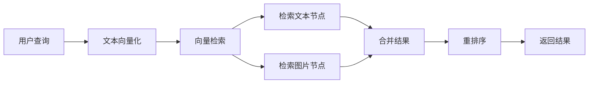

# 图片检索功能说明

## ✨ 新功能：图文混合检索

系统现在支持**图片检索**，可以通过查询返回相关的图片（包括二维码）及其路径和说明。

## 🎯 主要特性

### 1. 自动图片提取
- 从 Markdown 文档中提取所有图片（`` 格式）
- 提取图片的 alt 文本、周围文本作为上下文
- 自动识别图片说明（如"图："、"图1："等）

### 2. 图片作为检索单元
- 每个图片被当作特殊的 chunk（`content_type=image`）
- 包含图片的描述文本用于向量化
- 与文本节点一起参与混合检索

### 3. 二维码支持（可选）
- 如果安装了 `pyzbar`，可以识别二维码
- 提取二维码内容（URL、文本等）
- 标记二维码类型便于筛选

### 4. 无需 PyTorch
- 不使用图像模型（CLIP 等）
- 基于文本上下文进行检索
- 轻量级设计，避免大型依赖

## 📦 使用方法

### 1. 构建索引时启用图片

```bash
# 默认启用图片提取
python scripts/batch_process.py build \
    --data-dir /data/process \
    --storage-dir ./storage

# 显式禁用图片提取
python scripts/batch_process.py build \
    --data-dir /data/process \
    --storage-dir ./storage \
    --no-images
```

### 2. Python API 检索图片

```python
from knowledge_base.hierarchical_index import HierarchicalRetriever

# 初始化检索器
retriever = HierarchicalRetriever(
    storage_dir="./storage",
    enable_images=True  # 启用图片支持
)

# 方法1：混合检索（文本 + 图片）
results = retriever.retrieve_with_images(
    query="二维码 申请",
    top_k=10,
    image_only=False  # 返回文本和图片
)

print(f"找到 {results['total_images']} 个相关图片")
for img in results['image_results']:
    print(f"路径: {img['path']}")
    print(f"说明: {img['caption']}")
    if img['is_qrcode']:
        print(f"二维码内容: {img['qr_content']}")

# 方法2：只检索图片
results = retriever.retrieve_with_images(
    query="流程图 补贴",
    top_k=5,
    image_only=True  # 只返回图片
)
```

### 3. 返回的图片信息

```python
{
    'image_id': 'abc123',           # 图片唯一ID
    'path': 'images/qrcode.jpg',    # 相对路径
    'caption': '扫码申请补贴',       # 图片说明
    'is_qrcode': True,              # 是否是二维码
    'qr_content': 'http://...',     # 二维码内容
    'alt_text': '申请二维码',        # Alt 文本
    'width': 400,                   # 宽度（如果有 PIL）
    'height': 400                   # 高度（如果有 PIL）
}
```

## 🔍 检索原理

### 图片的文本表示

系统将图片转换为文本表示用于检索：

```
文件名: apply_qr
图片描述: 申请二维码
图片说明: 扫描上方二维码进入申请页面
上下文: 消费者可以通过以下方式申请...
```

### 检索流程



## 💡 使用场景

### 1. 查找二维码
```python
# 查找所有二维码
results = retriever.retrieve_with_images(
    query="二维码 扫码 扫描",
    image_only=True
)

# 筛选二维码
qr_images = [
    img for img in results['image_results']
    if img['is_qrcode']
]
```

### 2. 查找流程图
```python
# 查找流程相关的图片
results = retriever.retrieve_with_images(
    query="流程 步骤 流程图",
    top_k=5
)
```

### 3. 查找特定政策的图片
```python
# 查找家电补贴相关的所有图片
results = retriever.retrieve_with_images(
    query="家电 以旧换新 补贴",
    image_only=True
)
```

## 📊 测试脚本

运行测试脚本验证功能：

```bash
# 运行图片检索测试
python tests/test_image_retrieval.py
```

测试内容：
- 图片提取测试
- 构建包含图片的索引
- 图文混合检索
- 纯图片搜索

## ⚙️ 可选依赖

### 图片处理（可选）
```bash
# 获取图片尺寸
pip install pillow

# 识别二维码（可选）
pip install pyzbar
# 或
pip install pyzbar-wheels  # 不需要系统库
```

### 不需要的依赖
- ❌ PyTorch（不使用图像模型）
- ❌ transformers（不使用 CLIP）
- ❌ opencv-python（不需要图像处理）

## 🎨 自定义配置

### 1. 自定义图片说明提取

修改 `image_retrieval.py` 中的正则：

```python
# 自定义图说明模式
self.caption_pattern = re.compile(
    r'(?:图\s*[:：]|Figure\s*[:：])(.+)',
    re.IGNORECASE
)
```

### 2. 自定义上下文长度

```python
# 提取更多上下文
extractor._extract_context(
    image_info,
    md_content,
    position,
    context_size=500  # 默认200
)
```

## 📝 注意事项

1. **图片文件路径**
   - 系统保存相对路径（如 `images/xxx.jpg`）
   - 不会读取实际图片文件内容
   - 确保路径在使用时正确解析

2. **图片索引大小**
   - 每个图片约占 1-2KB 索引空间
   - 1000 个图片约 1-2MB 额外存储

3. **检索性能**
   - 图片节点与文本节点一起检索
   - 不影响整体检索速度
   - 可通过 `image_only` 参数优化

## 🚀 快速示例

```python
# 完整示例：查找补贴申请二维码
from knowledge_base.hierarchical_index import HierarchicalRetriever

# 初始化
retriever = HierarchicalRetriever("./storage", enable_images=True)

# 查询
results = retriever.retrieve_with_images("补贴申请二维码", top_k=3)

# 输出结果
for img in results['image_results']:
    print(f"""
图片: {img['path']}
说明: {img.get('caption', '无')}
是否二维码: {img.get('is_qrcode', False)}
""")
```

## 📈 后续优化

1. **添加 OCR**（如需要）
   - 使用 PaddleOCR 提取图片中的文字
   - 增强检索准确性

2. **图片缓存**
   - 缓存常用图片的元数据
   - 加速重复查询

3. **图片分类**
   - 自动分类（二维码、流程图、表格等）
   - 支持按类型筛选