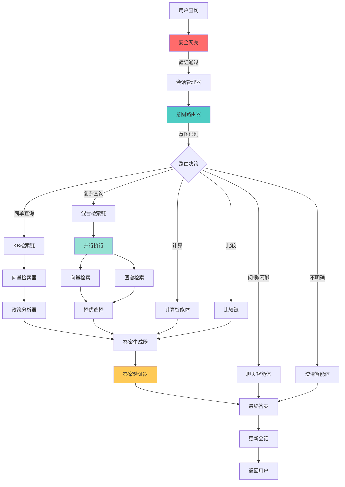

# 政策智能问答系统 - 智能体架构完整指南

## 📋 目录
1. [系统概述](#系统概述)
2. [架构设计](#架构设计)
3. [安全护栏](#安全护栏)
4. [部署方案](#部署方案)
5. [最佳实践](#最佳实践)
6. [监控与运维](#监控与运维)

---

## 系统概述

### 核心能力
- 🤖 多智能体协作的政策问答系统
- 🔍 向量检索 + 知识图谱混合检索
- 💬 多轮对话与上下文理解
- 🧮 政策计算与比较分析
- 🛡️ 多层安全防护机制

### 技术栈
```yaml
语言: Python 3.8+
异步框架: asyncio
智能体框架: AutoGen
LLM: OpenAI/DashScope
向量数据库: Milvus
知识图谱: LightRAG
Web框架: FastAPI
前端: Vue 3 + Element Plus
```

---

## 架构设计

### 1. 六层架构模型

```
┌─────────────────────────────────────────────────────────────┐
│                      用户交互层 (User Layer)                  │
│                    Web UI / API / CLI                        │
└─────────────────────────────────────────────────────────────┘
                              ↓
┌─────────────────────────────────────────────────────────────┐
│                  安全网关层 (Security Gateway)                │
│        身份验证 | 授权 | 限流 | 输入验证 | 审计日志            │
└─────────────────────────────────────────────────────────────┘
                              ↓
┌─────────────────────────────────────────────────────────────┐
│                   编排层 (Orchestration Layer)               │
│     SmartOrchestrator | EnhancedOrchestrator | Workflows     │
└─────────────────────────────────────────────────────────────┘
                              ↓
┌─────────────────────────────────────────────────────────────┐
│                  路由层 (Routing Layer)                       │
│         IntentRouter | SessionManager | LLMClassifier        │
└─────────────────────────────────────────────────────────────┘
                              ↓
┌─────────────────────────────────────────────────────────────┐
│                   智能体层 (Agent Layer)                      │
│  检索 | 分析 | 生成 | 验证 | 计算 | 比较 | 聊天 | 澄清        │
└─────────────────────────────────────────────────────────────┘
                              ↓
┌─────────────────────────────────────────────────────────────┐
│               基础设施层 (Infrastructure Layer)               │
│   MessageBus | AgentRegistry | Orchestrator | AgentMaster    │
└─────────────────────────────────────────────────────────────┘
```

### 2. 智能体交互流程图



### 3. 核心组件详解

#### 3.1 安全网关 (Security Gateway) - **新增**

```python
# /data/temp33/gov/agents/security/gateway.py

from typing import Optional, Dict, Any
import asyncio
import hashlib
import time
from datetime import datetime, timedelta
from collections import defaultdict

class SecurityGateway:
    """安全网关 - 系统的第一道防线"""

    def __init__(self):
        self.auth_manager = AuthenticationManager()
        self.authz_manager = AuthorizationManager()
        self.rate_limiter = RateLimiter()
        self.input_validator = InputValidator()
        self.audit_logger = AuditLogger()
        self.content_filter = ContentFilter()

    async def process_request(self, request: Dict[str, Any]) -> Dict[str, Any]:
        """处理请求的完整安全检查流程"""

        # 1. 身份验证
        user = await self.auth_manager.authenticate(request)
        if not user:
            self.audit_logger.log_auth_failure(request)
            raise AuthenticationError("身份验证失败")

        # 2. 速率限制
        if not await self.rate_limiter.check_limit(user.id):
            self.audit_logger.log_rate_limit(user.id)
            raise RateLimitError("请求过于频繁，请稍后再试")

        # 3. 授权检查
        if not await self.authz_manager.authorize(user, request.get('action')):
            self.audit_logger.log_authz_failure(user.id, request)
            raise AuthorizationError("无权执行此操作")

        # 4. 输入验证
        validated_input = await self.input_validator.validate(request.get('query'))
        if not validated_input['valid']:
            self.audit_logger.log_invalid_input(user.id, request, validated_input['reason'])
            raise ValidationError(f"输入验证失败: {validated_input['reason']}")

        # 5. 内容过滤
        filtered_query = await self.content_filter.filter(validated_input['query'])

        # 6. 审计日志
        await self.audit_logger.log_request(user.id, filtered_query, request)

        return {
            'user': user,
            'query': filtered_query,
            'original_request': request,
            'security_context': {
                'timestamp': datetime.now(),
                'ip_address': request.get('ip_address'),
                'user_agent': request.get('user_agent')
            }
        }


class AuthenticationManager:
    """身份验证管理器"""

    def __init__(self):
        self.session_store = {}  # 生产环境用Redis
        self.token_expire_time = timedelta(hours=24)

    async def authenticate(self, request: Dict[str, Any]) -> Optional['User']:
        """验证用户身份"""
        token = request.get('token')
        if not token:
            return None

        # JWT验证
        try:
            payload = self._verify_jwt(token)
            user_id = payload.get('user_id')

            # 检查会话
            session = self.session_store.get(user_id)
            if not session or session['expires_at'] < datetime.now():
                return None

            return User(
                id=user_id,
                username=payload.get('username'),
                roles=payload.get('roles', []),
                permissions=payload.get('permissions', [])
            )
        except Exception as e:
            return None

    def _verify_jwt(self, token: str) -> Dict:
        """验证JWT令牌"""
        # 实现JWT验证逻辑
        import jwt
        secret = os.getenv('JWT_SECRET', 'your-secret-key')
        return jwt.decode(token, secret, algorithms=['HS256'])


class AuthorizationManager:
    """授权管理器 - RBAC"""

    def __init__(self):
        # 角色-权限映射
        self.role_permissions = {
            'admin': ['*'],  # 所有权限
            'user': [
                'query:read',
                'policy:read',
                'calculation:execute',
                'comparison:execute'
            ],
            'guest': [
                'query:read',
                'policy:read'
            ]
        }

    async def authorize(self, user: 'User', action: str) -> bool:
        """检查用户是否有权限执行操作"""
        if not action:
            return True

        for role in user.roles:
            permissions = self.role_permissions.get(role, [])
            if '*' in permissions or action in permissions:
                return True

        return False


class RateLimiter:
    """速率限制器 - 令牌桶算法"""

    def __init__(self):
        self.buckets = defaultdict(lambda: {
            'tokens': 100,  # 初始令牌数
            'last_update': time.time(),
            'capacity': 100,  # 桶容量
            'refill_rate': 10  # 每秒补充令牌数
        })

        # 不同级别的限制
        self.limits = {
            'per_second': 10,
            'per_minute': 60,
            'per_hour': 1000,
            'per_day': 10000
        }

    async def check_limit(self, user_id: str) -> bool:
        """检查是否超过速率限制"""
        bucket = self.buckets[user_id]

        # 更新令牌
        now = time.time()
        time_passed = now - bucket['last_update']
        bucket['tokens'] = min(
            bucket['capacity'],
            bucket['tokens'] + time_passed * bucket['refill_rate']
        )
        bucket['last_update'] = now

        # 消耗令牌
        if bucket['tokens'] >= 1:
            bucket['tokens'] -= 1
            return True

        return False


class InputValidator:
    """输入验证器"""

    def __init__(self):
        self.max_query_length = 2000
        self.max_tokens = 1500

        # 危险模式
        self.dangerous_patterns = [
            r'<script[^>]*>.*?</script>',  # XSS
            r'(union|select|insert|update|delete|drop|create|alter)\s+',  # SQL注入
            r'[;\|\&\$\`]',  # 命令注入
            r'\.\./',  # 路径遍历
        ]

    async def validate(self, query: str) -> Dict[str, Any]:
        """验证输入查询"""
        import re

        if not query or not query.strip():
            return {'valid': False, 'reason': '查询不能为空'}

        # 长度检查
        if len(query) > self.max_query_length:
            return {'valid': False, 'reason': f'查询长度超过限制 ({self.max_query_length}字符)'}

        # 危险模式检查
        for pattern in self.dangerous_patterns:
            if re.search(pattern, query, re.IGNORECASE):
                return {'valid': False, 'reason': '检测到潜在的恶意输入'}

        # Unicode字符检查
        try:
            query.encode('utf-8')
        except UnicodeEncodeError:
            return {'valid': False, 'reason': '包含非法字符'}

        return {'valid': True, 'query': query.strip()}


class ContentFilter:
    """内容过滤器"""

    def __init__(self):
        # 敏感词列表
        self.sensitive_words = self._load_sensitive_words()

    async def filter(self, text: str) -> str:
        """过滤敏感内容"""
        filtered = text

        # 敏感词替换
        for word in self.sensitive_words:
            filtered = filtered.replace(word, '*' * len(word))

        return filtered

    def _load_sensitive_words(self) -> list:
        """加载敏感词库"""
        # 从文件或数据库加载
        return []


class AuditLogger:
    """审计日志记录器"""

    def __init__(self):
        self.log_file = "logs/audit.log"
        self.setup_logger()

    def setup_logger(self):
        """配置日志记录器"""
        import logging
        self.logger = logging.getLogger('audit')
        self.logger.setLevel(logging.INFO)

        # 文件处理器
        fh = logging.FileHandler(self.log_file)
        formatter = logging.Formatter(
            '%(asctime)s | %(levelname)s | %(message)s'
        )
        fh.setFormatter(formatter)
        self.logger.addHandler(fh)

    async def log_request(self, user_id: str, query: str, request: Dict):
        """记录请求日志"""
        self.logger.info(
            f"USER={user_id} | QUERY={query[:100]} | IP={request.get('ip_address')}"
        )

    def log_auth_failure(self, request: Dict):
        """记录认证失败"""
        self.logger.warning(
            f"AUTH_FAILURE | IP={request.get('ip_address')} | TOKEN={request.get('token')[:20] if request.get('token') else 'None'}"
        )

    def log_authz_failure(self, user_id: str, request: Dict):
        """记录授权失败"""
        self.logger.warning(
            f"AUTHZ_FAILURE | USER={user_id} | ACTION={request.get('action')}"
        )

    def log_rate_limit(self, user_id: str):
        """记录速率限制"""
        self.logger.warning(f"RATE_LIMIT | USER={user_id}")

    def log_invalid_input(self, user_id: str, request: Dict, reason: str):
        """记录无效输入"""
        self.logger.warning(
            f"INVALID_INPUT | USER={user_id} | REASON={reason} | QUERY={request.get('query')[:100]}"
        )


# 异常类
class SecurityError(Exception):
    """安全相关异常的基类"""
    pass

class AuthenticationError(SecurityError):
    """身份验证失败"""
    pass

class AuthorizationError(SecurityError):
    """授权失败"""
    pass

class RateLimitError(SecurityError):
    """速率限制"""
    pass

class ValidationError(SecurityError):
    """验证失败"""
    pass


# 用户模型
class User:
    def __init__(self, id: str, username: str, roles: list, permissions: list):
        self.id = id
        self.username = username
        self.roles = roles
        self.permissions = permissions
```

#### 3.2 监控告警系统 - **新增**

```python
# /data/temp33/gov/agents/monitoring/monitor.py

import time
import asyncio
from typing import Dict, Any, List
from collections import deque
from dataclasses import dataclass
from datetime import datetime, timedelta

@dataclass
class Metric:
    """指标数据"""
    name: str
    value: float
    timestamp: datetime
    tags: Dict[str, str]

@dataclass
class Alert:
    """告警"""
    level: str  # INFO, WARNING, ERROR, CRITICAL
    message: str
    timestamp: datetime
    metric: Metric
    threshold: float


class SystemMonitor:
    """系统监控器"""

    def __init__(self):
        self.metrics = defaultdict(lambda: deque(maxlen=1000))
        self.alert_manager = AlertManager()
        self.health_checker = HealthChecker()

        # 告警阈值
        self.thresholds = {
            'response_time': {'warning': 1.0, 'error': 3.0, 'critical': 5.0},
            'error_rate': {'warning': 0.05, 'error': 0.1, 'critical': 0.2},
            'queue_size': {'warning': 100, 'error': 500, 'critical': 1000},
            'memory_usage': {'warning': 0.7, 'error': 0.85, 'critical': 0.95},
            'cpu_usage': {'warning': 0.7, 'error': 0.85, 'critical': 0.95}
        }

    async def record_metric(self, name: str, value: float, tags: Dict[str, str] = None):
        """记录指标"""
        metric = Metric(
            name=name,
            value=value,
            timestamp=datetime.now(),
            tags=tags or {}
        )
        self.metrics[name].append(metric)

        # 检查阈值
        await self._check_threshold(metric)

    async def _check_threshold(self, metric: Metric):
        """检查指标是否超过阈值"""
        if metric.name not in self.thresholds:
            return

        thresholds = self.thresholds[metric.name]

        if metric.value >= thresholds.get('critical', float('inf')):
            await self.alert_manager.send_alert(Alert(
                level='CRITICAL',
                message=f"{metric.name} 达到临界值: {metric.value}",
                timestamp=datetime.now(),
                metric=metric,
                threshold=thresholds['critical']
            ))
        elif metric.value >= thresholds.get('error', float('inf')):
            await self.alert_manager.send_alert(Alert(
                level='ERROR',
                message=f"{metric.name} 达到错误阈值: {metric.value}",
                timestamp=datetime.now(),
                metric=metric,
                threshold=thresholds['error']
            ))
        elif metric.value >= thresholds.get('warning', float('inf')):
            await self.alert_manager.send_alert(Alert(
                level='WARNING',
                message=f"{metric.name} 达到警告阈值: {metric.value}",
                timestamp=datetime.now(),
                metric=metric,
                threshold=thresholds['warning']
            ))

    def get_metrics(self, name: str, duration: timedelta = None) -> List[Metric]:
        """获取指标历史"""
        metrics = list(self.metrics[name])

        if duration:
            cutoff = datetime.now() - duration
            metrics = [m for m in metrics if m.timestamp >= cutoff]

        return metrics

    def get_statistics(self, name: str, duration: timedelta = None) -> Dict[str, float]:
        """获取指标统计"""
        metrics = self.get_metrics(name, duration)
        if not metrics:
            return {}

        values = [m.value for m in metrics]
        return {
            'count': len(values),
            'min': min(values),
            'max': max(values),
            'avg': sum(values) / len(values),
            'p50': self._percentile(values, 50),
            'p95': self._percentile(values, 95),
            'p99': self._percentile(values, 99)
        }

    @staticmethod
    def _percentile(values: List[float], p: int) -> float:
        """计算百分位数"""
        sorted_values = sorted(values)
        k = (len(sorted_values) - 1) * p / 100
        f = int(k)
        c = f + 1 if f + 1 < len(sorted_values) else f
        return sorted_values[f] + (k - f) * (sorted_values[c] - sorted_values[f])


class AlertManager:
    """告警管理器"""

    def __init__(self):
        self.alert_channels = []
        self.alert_history = deque(maxlen=1000)
        self.suppression_rules = {}  # 告警抑制规则

    def add_channel(self, channel: 'AlertChannel'):
        """添加告警通道"""
        self.alert_channels.append(channel)

    async def send_alert(self, alert: Alert):
        """发送告警"""
        # 检查是否需要抑制
        if self._should_suppress(alert):
            return

        self.alert_history.append(alert)

        # 发送到所有通道
        for channel in self.alert_channels:
            try:
                await channel.send(alert)
            except Exception as e:
                print(f"发送告警失败: {e}")

    def _should_suppress(self, alert: Alert) -> bool:
        """检查是否应该抑制告警"""
        # 同一指标在5分钟内只告警一次
        key = f"{alert.metric.name}:{alert.level}"
        last_alert_time = self.suppression_rules.get(key)

        if last_alert_time and (datetime.now() - last_alert_time) < timedelta(minutes=5):
            return True

        self.suppression_rules[key] = datetime.now()
        return False


class AlertChannel:
    """告警通道基类"""

    async def send(self, alert: Alert):
        raise NotImplementedError


class LogAlertChannel(AlertChannel):
    """日志告警通道"""

    async def send(self, alert: Alert):
        import logging
        logger = logging.getLogger('alerts')

        if alert.level == 'CRITICAL':
            logger.critical(alert.message)
        elif alert.level == 'ERROR':
            logger.error(alert.message)
        elif alert.level == 'WARNING':
            logger.warning(alert.message)
        else:
            logger.info(alert.message)


class EmailAlertChannel(AlertChannel):
    """邮件告警通道"""

    def __init__(self, smtp_config: Dict):
        self.smtp_config = smtp_config

    async def send(self, alert: Alert):
        # 实现邮件发送逻辑
        pass


class HealthChecker:
    """健康检查器"""

    def __init__(self):
        self.checks = {}

    def register_check(self, name: str, check_func):
        """注册健康检查"""
        self.checks[name] = check_func

    async def check_all(self) -> Dict[str, Any]:
        """执行所有健康检查"""
        results = {}

        for name, check_func in self.checks.items():
            try:
                result = await check_func()
                results[name] = {'status': 'healthy', 'details': result}
            except Exception as e:
                results[name] = {'status': 'unhealthy', 'error': str(e)}

        overall_status = 'healthy' if all(
            r['status'] == 'healthy' for r in results.values()
        ) else 'unhealthy'

        return {
            'status': overall_status,
            'checks': results,
            'timestamp': datetime.now().isoformat()
        }
```

#### 3.3 智能体装饰器与中间件 - **新增**

```python
# /data/temp33/gov/agents/decorators/middleware.py

import functools
import time
import asyncio
from typing import Callable, Any

def with_retry(max_retries: int = 3, backoff: float = 1.0):
    """重试装饰器"""
    def decorator(func: Callable) -> Callable:
        @functools.wraps(func)
        async def wrapper(*args, **kwargs):
            last_exception = None

            for attempt in range(max_retries):
                try:
                    return await func(*args, **kwargs)
                except Exception as e:
                    last_exception = e
                    if attempt < max_retries - 1:
                        wait_time = backoff * (2 ** attempt)
                        await asyncio.sleep(wait_time)

            raise last_exception
        return wrapper
    return decorator


def with_timeout(seconds: float):
    """超时装饰器"""
    def decorator(func: Callable) -> Callable:
        @functools.wraps(func)
        async def wrapper(*args, **kwargs):
            try:
                return await asyncio.wait_for(func(*args, **kwargs), timeout=seconds)
            except asyncio.TimeoutError:
                raise TimeoutError(f"函数 {func.__name__} 执行超时 ({seconds}秒)")
        return wrapper
    return decorator


def with_metrics(monitor: 'SystemMonitor'):
    """指标收集装饰器"""
    def decorator(func: Callable) -> Callable:
        @functools.wraps(func)
        async def wrapper(*args, **kwargs):
            start_time = time.time()
            error = None

            try:
                result = await func(*args, **kwargs)
                return result
            except Exception as e:
                error = e
                raise
            finally:
                duration = time.time() - start_time

                # 记录执行时间
                await monitor.record_metric(
                    f"{func.__name__}.duration",
                    duration,
                    {'status': 'error' if error else 'success'}
                )

                # 记录调用次数
                await monitor.record_metric(
                    f"{func.__name__}.calls",
                    1,
                    {'status': 'error' if error else 'success'}
                )

        return wrapper
    return decorator


def with_circuit_breaker(failure_threshold: int = 5, timeout: float = 60.0):
    """断路器装饰器"""
    def decorator(func: Callable) -> Callable:
        state = {'failures': 0, 'last_failure_time': None, 'is_open': False}

        @functools.wraps(func)
        async def wrapper(*args, **kwargs):
            # 检查断路器状态
            if state['is_open']:
                if time.time() - state['last_failure_time'] > timeout:
                    # 尝试半开状态
                    state['is_open'] = False
                    state['failures'] = 0
                else:
                    raise Exception(f"断路器打开: {func.__name__}")

            try:
                result = await func(*args, **kwargs)
                # 成功，重置失败计数
                state['failures'] = 0
                return result
            except Exception as e:
                # 失败，增加计数
                state['failures'] += 1
                state['last_failure_time'] = time.time()

                # 检查是否需要打开断路器
                if state['failures'] >= failure_threshold:
                    state['is_open'] = True

                raise

        return wrapper
    return decorator


def with_cache(ttl: float = 300.0):
    """缓存装饰器"""
    def decorator(func: Callable) -> Callable:
        cache = {}

        @functools.wraps(func)
        async def wrapper(*args, **kwargs):
            # 生成缓存键
            key = f"{func.__name__}:{str(args)}:{str(kwargs)}"

            # 检查缓存
            if key in cache:
                cached_value, cached_time = cache[key]
                if time.time() - cached_time < ttl:
                    return cached_value

            # 执行函数
            result = await func(*args, **kwargs)

            # 缓存结果
            cache[key] = (result, time.time())

            return result

        return wrapper
    return decorator
```

### 4. 推荐的智能体架构

#### 方案一：SmartOrchestrator（推荐用于生产环境）

**优势：**
- ✅ 智能路由，自动选择最优处理链
- ✅ 并行执行，支持多链竞争
- ✅ 早停机制，高置信度立即返回
- ✅ 完善的回退机制
- ✅ 会话管理集成

**使用场景：**
- 复杂的政策问答
- 需要混合检索策略
- 对响应时间有要求
- 需要高准确率

**示例代码：**
```python
# /data/temp33/gov/examples/smart_orchestrator_example.py

import asyncio
from agents.orchestrators.smart import SmartOrchestrator
from agents.security.gateway import SecurityGateway
from agents.monitoring.monitor import SystemMonitor

async def main():
    # 初始化组件
    security = SecurityGateway()
    monitor = SystemMonitor()
    orchestrator = SmartOrchestrator()

    # 用户请求
    request = {
        'token': 'user_jwt_token',
        'query': '济南市家电以旧换新补贴政策有哪些要求？',
        'ip_address': '192.168.1.100',
        'user_agent': 'Mozilla/5.0'
    }

    try:
        # 安全检查
        validated_request = await security.process_request(request)

        # 记录开始时间
        start_time = time.time()

        # 执行查询
        result = await orchestrator.process(
            query=validated_request['query'],
            session_id=validated_request['user'].id
        )

        # 记录指标
        duration = time.time() - start_time
        await monitor.record_metric('query.duration', duration)
        await monitor.record_metric('query.success', 1)

        print("答案:", result['answer'])
        print("置信度:", result['confidence'])

    except Exception as e:
        await monitor.record_metric('query.error', 1)
        print(f"错误: {e}")

if __name__ == '__main__':
    asyncio.run(main())
```

#### 方案二：EnhancedOrchestrator（推荐用于复杂场景）

**优势：**
- ✅ 固定7步流程，可控性强
- ✅ 支持文档并行分析
- ✅ 完整的答案验证
- ✅ 适合需要透明度的场景

**使用场景：**
- 需要详细的处理步骤跟踪
- 需要强制验证答案
- 对准确性要求极高
- 适合审计和合规场景

#### 方案三：混合方案（最佳实践）

结合两者优势：

```python
# /data/temp33/gov/agents/orchestrators/hybrid.py

class HybridOrchestrator:
    """混合编排器 - 结合Smart和Enhanced的优势"""

    def __init__(self):
        self.smart = SmartOrchestrator()
        self.enhanced = EnhancedOrchestrator()
        self.router = IntentRouter()

    async def process(self, query: str, session_id: str = None):
        # 分析查询复杂度
        intent = await self.router.analyze_intent(query)
        complexity = self._calculate_complexity(intent)

        # 简单查询用SmartOrchestrator（快速）
        if complexity < 0.5:
            return await self.smart.process(query, session_id)

        # 复杂查询用EnhancedOrchestrator（准确）
        else:
            return await self.enhanced.run_workflow(query, session_id)

    def _calculate_complexity(self, intent: Dict) -> float:
        """计算查询复杂度"""
        score = 0.0

        # 实体数量
        score += len(intent.get('entities', [])) * 0.1

        # 意图类型
        if intent.get('intent') in ['comparison', 'recommendation']:
            score += 0.3

        # 查询长度
        score += min(len(intent.get('query', '')) / 100, 0.2)

        return min(score, 1.0)
```

---

## 安全护栏

### 1. 输入层安全

```yaml
输入验证:
  - 长度限制: 2000字符
  - 特殊字符过滤: 防止注入攻击
  - 编码检查: UTF-8验证
  - 恶意模式检测: XSS, SQL注入, 命令注入

内容过滤:
  - 敏感词过滤
  - PII检测与脱敏
  - 违规内容识别
```

### 2. 身份认证与授权

```yaml
认证机制:
  - JWT令牌: 24小时过期
  - 会话管理: Redis存储
  - 刷新令牌: 7天有效期

授权机制:
  - RBAC: 基于角色的访问控制
  - 权限粒度:
    - admin: 所有权限
    - user: 查询、计算、比较
    - guest: 仅查询
```

### 3. 速率限制

```yaml
全局限制:
  - 每秒: 10请求
  - 每分钟: 60请求
  - 每小时: 1000请求
  - 每天: 10000请求

用户级限制:
  - 令牌桶算法
  - 容量: 100
  - 补充速率: 10/秒

智能体限制:
  - 并发限制: 信号量控制
  - 队列长度: 1000
  - 超时控制: 可配置
```

### 4. 数据安全

```yaml
传输安全:
  - HTTPS/TLS 1.3
  - 证书验证

存储安全:
  - 敏感数据加密(AES-256)
  - 密钥管理(KMS)
  - 访问日志

隐私保护:
  - PII脱敏
  - 数据最小化原则
  - 用户数据隔离
```

### 5. 智能体安全

```yaml
执行安全:
  - 超时控制: 防止死锁
  - 重试限制: 防止无限重试
  - 断路器: 快速失败
  - 资源限制: 防止资源耗尽

输出安全:
  - 内容审核
  - 注入防护
  - 长度限制
  - 格式验证
```

### 6. 监控与审计

```yaml
实时监控:
  - 请求量监控
  - 响应时间监控
  - 错误率监控
  - 资源使用监控

审计日志:
  - 所有请求记录
  - 认证失败记录
  - 授权失败记录
  - 异常操作记录
  - 保留期: 90天

告警机制:
  - 阈值告警
  - 异常检测
  - 告警聚合
  - 多通道通知(邮件、短信、钉钉)
```

---

## 部署方案

### 1. 开发环境

```bash
# 本地开发
cd /data/temp33/gov

# 启动依赖服务
docker-compose up -d milvus redis

# 启动后端
python api_server.py

# 启动前端
cd web && npm run dev
```

### 2. 生产环境（Docker + Kubernetes）

```yaml
# docker-compose.prod.yml
version: '3.8'

services:
  # Milvus向量数据库
  milvus:
    image: milvusdb/milvus:latest
    ports:
      - "19530:19530"
    volumes:
      - milvus_data:/var/lib/milvus
    environment:
      ETCD_ENDPOINTS: etcd:2379
      MINIO_ADDRESS: minio:9000

  # Redis缓存
  redis:
    image: redis:7-alpine
    ports:
      - "6379:6379"
    volumes:
      - redis_data:/data

  # 后端API
  api:
    build: .
    ports:
      - "8000:8000"
    environment:
      - MILVUS_HOST=milvus
      - REDIS_HOST=redis
      - JWT_SECRET=${JWT_SECRET}
    depends_on:
      - milvus
      - redis

  # 前端
  web:
    build: ./web
    ports:
      - "80:80"
    depends_on:
      - api

  # Nginx反向代理
  nginx:
    image: nginx:alpine
    ports:
      - "443:443"
    volumes:
      - ./nginx.conf:/etc/nginx/nginx.conf
      - ./ssl:/etc/nginx/ssl
    depends_on:
      - web
      - api

volumes:
  milvus_data:
  redis_data:
```

### 3. Kubernetes部署

```yaml
# k8s/deployment.yaml
apiVersion: apps/v1
kind: Deployment
metadata:
  name: policy-qa-api
spec:
  replicas: 3
  selector:
    matchLabels:
      app: policy-qa-api
  template:
    metadata:
      labels:
        app: policy-qa-api
    spec:
      containers:
      - name: api
        image: policy-qa-api:latest
        ports:
        - containerPort: 8000
        env:
        - name: MILVUS_HOST
          value: "milvus-service"
        - name: REDIS_HOST
          value: "redis-service"
        resources:
          requests:
            memory: "512Mi"
            cpu: "500m"
          limits:
            memory: "2Gi"
            cpu: "2000m"
        livenessProbe:
          httpGet:
            path: /api/health
            port: 8000
          initialDelaySeconds: 30
          periodSeconds: 10
        readinessProbe:
          httpGet:
            path: /api/health
            port: 8000
          initialDelaySeconds: 5
          periodSeconds: 5
---
apiVersion: v1
kind: Service
metadata:
  name: policy-qa-api-service
spec:
  selector:
    app: policy-qa-api
  ports:
  - protocol: TCP
    port: 80
    targetPort: 8000
  type: LoadBalancer
```

---

## 最佳实践

### 1. 智能体设计原则

```yaml
单一职责:
  - 每个智能体只负责一个明确的任务
  - 避免功能重叠

松耦合:
  - 通过消息总线通信
  - 避免直接依赖

高内聚:
  - 相关功能组织在一起
  - 清晰的模块边界

可测试性:
  - 单元测试覆盖率 > 80%
  - 集成测试覆盖核心流程

可观测性:
  - 完整的日志记录
  - 指标收集
  - 分布式追踪
```

### 2. 错误处理策略

```python
# 三层错误处理
try:
    # 1. 智能体层：捕获并转换异常
    result = await agent.process(query)
except AgentError as e:
    # 2. 编排层：尝试降级或重试
    result = await fallback_agent.process(query)
except Exception as e:
    # 3. API层：返回友好错误信息
    return {"error": "系统暂时不可用，请稍后重试"}
```

### 3. 性能优化

```yaml
缓存策略:
  - L1: 内存缓存 (LRU, 5分钟)
  - L2: Redis缓存 (30分钟)
  - 向量检索结果缓存

并行化:
  - 文档分析并行
  - 多链并行执行
  - 早停优化

资源池化:
  - LLM客户端连接池
  - 数据库连接池
  - 线程池/进程池

批处理:
  - 向量化批处理
  - 批量文档检索
```

### 4. 配置管理

```yaml
# config/production.yaml
system:
  name: "政策智能问答系统"
  version: "1.0.0"
  environment: "production"

security:
  jwt_secret: ${JWT_SECRET}
  token_expire_hours: 24
  max_session_age_seconds: 3600

rate_limit:
  per_second: 10
  per_minute: 60
  per_hour: 1000
  per_day: 10000

orchestrator:
  type: "smart"  # smart | enhanced | hybrid
  timeout_seconds: 30
  max_retries: 3
  parallel_chains: true
  early_stopping: true
  confidence_threshold: 0.8

agents:
  retrieval:
    top_k: 10
    threshold: 0.7
    timeout: 10

  analysis:
    parallel_limit: 5
    timeout: 15

  generation:
    max_tokens: 1000
    temperature: 0.7

monitoring:
  enable: true
  metrics_interval: 60
  alert_channels:
    - type: "log"
    - type: "email"
      recipients: ["admin@example.com"]
```

---

## 监控与运维

### 1. 核心指标

```yaml
业务指标:
  - 查询总量 (QPS)
  - 查询成功率
  - 平均响应时间
  - P95/P99响应时间
  - 用户满意度

系统指标:
  - CPU使用率
  - 内存使用率
  - 网络IO
  - 磁盘IO
  - 队列长度

智能体指标:
  - 智能体调用次数
  - 智能体成功率
  - 智能体平均耗时
  - 错误类型分布
```

### 2. 告警规则

```yaml
P0 (紧急):
  - 系统不可用
  - 错误率 > 20%
  - 响应时间 > 5秒

P1 (重要):
  - 错误率 > 10%
  - 响应时间 > 3秒
  - CPU/内存 > 95%

P2 (一般):
  - 错误率 > 5%
  - 响应时间 > 1秒
  - CPU/内存 > 85%

P3 (提示):
  - 队列积压
  - 缓存命中率下降
```

### 3. 日志规范

```python
# 结构化日志
import logging
import json

logger = logging.getLogger(__name__)

def log_query(user_id, query, result, duration):
    logger.info(json.dumps({
        'type': 'query',
        'user_id': user_id,
        'query': query[:100],
        'result_length': len(result),
        'duration': duration,
        'timestamp': datetime.now().isoformat()
    }))
```

### 4. 性能分析

```python
# 使用装饰器进行性能分析
@with_metrics(monitor)
@with_timeout(30)
@with_retry(max_retries=3)
async def process_query(query: str):
    # 处理逻辑
    pass
```

---

## 快速开始清单

### 开发阶段
- [ ] 克隆代码仓库
- [ ] 安装Python依赖
- [ ] 配置环境变量
- [ ] 启动Milvus和Redis
- [ ] 运行单元测试
- [ ] 启动开发服务器

### 安全加固
- [ ] 实现SecurityGateway
- [ ] 配置JWT认证
- [ ] 启用速率限制
- [ ] 添加输入验证
- [ ] 配置HTTPS
- [ ] 启用审计日志

### 监控部署
- [ ] 部署SystemMonitor
- [ ] 配置告警通道
- [ ] 设置告警阈值
- [ ] 集成日志收集
- [ ] 配置监控面板

### 生产部署
- [ ] 构建Docker镜像
- [ ] 配置Kubernetes
- [ ] 部署到生产环境
- [ ] 配置负载均衡
- [ ] 配置备份策略
- [ ] 灰度发布

---

## 常见问题

### Q1: 如何选择编排器？
**A:**
- 简单场景 → SimpleController
- 一般场景 → SmartOrchestrator
- 复杂场景 → EnhancedOrchestrator
- 混合需求 → HybridOrchestrator

### Q2: 如何提高响应速度？
**A:**
- 启用并行执行
- 使用缓存
- 启用早停机制
- 优化检索Top-K值
- 使用更快的嵌入模型

### Q3: 如何保证答案准确性？
**A:**
- 使用EnhancedOrchestrator
- 启用答案验证
- 提高检索阈值
- 增加文档数量
- 使用混合检索

### Q4: 如何处理高并发？
**A:**
- 水平扩展API实例
- 使用消息队列
- 启用Redis缓存
- 配置连接池
- 使用CDN

### Q5: 如何保证安全性？
**A:**
- 部署SecurityGateway
- 启用认证授权
- 配置速率限制
- 使用HTTPS
- 定期安全审计

---

## 技术支持

如有问题，请参考：
- 📖 详细文档: `/docs`
- 💬 问题反馈: GitHub Issues
- 📧 技术支持: support@example.com

---

**文档版本**: v1.0.0
**最后更新**: 2025-11-07
**维护者**: 智能体架构团队
